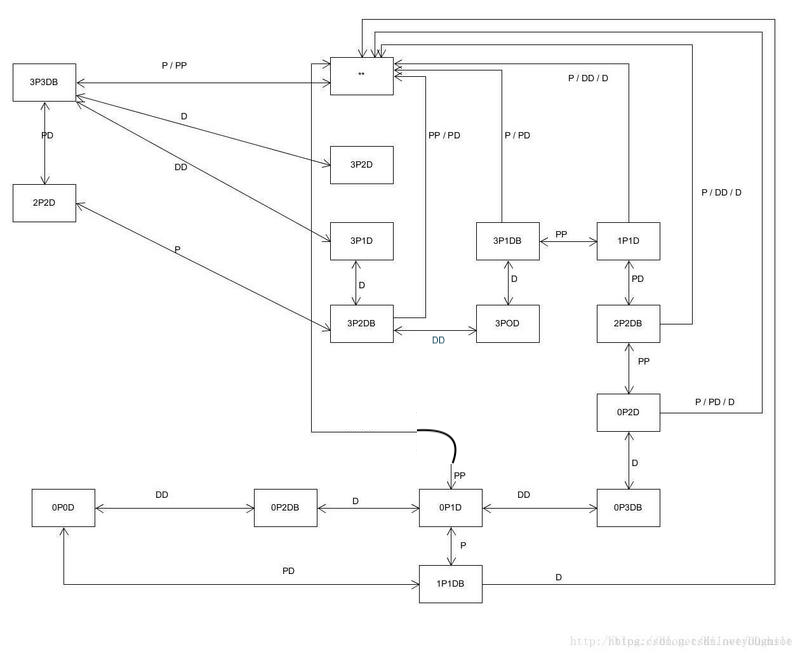
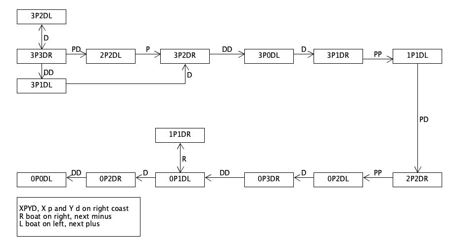
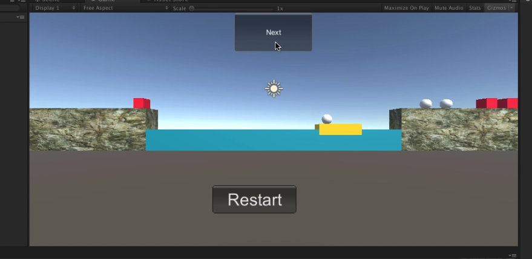

## hw10游戏智能

### 1.作业内容

P&D 过河游戏智能帮助实现，程序具体要求：

- 实现状态图的自动生成
- 讲解图数据在程序中的表示方法
- 利用算法实现下一步的计算
- 参考：[P&D 过河游戏智能帮助实现](https://blog.csdn.net/kiloveyousmile/article/details/71727667)

### 2.过河状态图



该状态图记录了游戏过程中右岸的情况（自己做的是从右岸开始的），左岸可以通过减法得到。

1. P代表牧师，D代表魔鬼，B代表船。
2. 当船在右岸时将给状态图添加一个B，在左岸时不加B。

3. P与D前面的数字表达的是右岸中牧师和魔鬼的数量（包括船在右岸情况下的人）。
4. 箭头上的字母表示移动的人员数量以及种类，通过该移动可以转化成另外一种状态，双箭头代表两个状态可以相互转化。
   * P：船运载一个牧师
   * D：船运载一个恶魔
   * PP：船运载两个牧师
   * DD：船运载两个恶魔
   * PD：船运载一个牧师，一个恶魔

5. 状态图中为`...`的是游戏失败状态，指向有效状态的箭头为玩家可进行的操作（游戏不结束的操作）。


### 3. 讲解图数据在程序中的表示方法

1. 要判断程序的状态首先肯定要得到右岸上牧师以及恶魔的数量，这里通过scenecontoller获得岸以及船的model，通过model就可以得到对应的变量信息了。

* 牧师、恶魔数量以及船的位置状态变量

```
private int devilNum;
private int priestNum;
private int BoatCoast; // -1 -> left, 1 -> right.
```

* 获得变量信息

```
int[] fromCount = scenecontroller.coast_from.getCoastModel().getCharacterNum();
priestNum = fromCount[0];
devilNum = fromCount[1];
BoatCoast = scenecontroller.boat.getModel().getTFflag();
```

2. 因为游戏的状态太多，而动作挺少的，所以这里只需要表达下一步的怎么做就好了。所以这里设置一个动作枚举，表达下一步船的动作，记录移动多少个牧师或者恶魔。

```
private enum BoatAction {empty, P, D, PP, DD, PD }
```

3. 具体游戏状态判断在获得下一步船动作的函数中进行，在该函数中，通过上面model中获得的牧师、恶魔数量，以及船的位置来找到状态图对应的位置，然后获得当前游戏在状态图中的位置。

```
 private BoatAction getNextAction()
    {
        ...
        if (BoatCoast == 1)
        {
            if (devilNum == 3 && priestNum == 3)
            {
                //3P3DR
            }
            ...
            else if(devilNum == 3 && priestNum == 2)
            {
                //2P3DR
            }
            else next = BoatAction.empty;
        }
        else
        {
            if (devilNum == 2 && priestNum == 2)
            {
                //2P2DL
            }
            ...
            else if (devilNum == 1 && priestNum == 0)
            {
                //0P1DL
            }
            else next = BoatAction.empty;
        }
        return next;
    }
```

### 4. 利用算法实现下一步的计算

1. AI状态转化图



这里另外自己画了一个图，L表示船在左边，R表示船在右边，数字以及P、R都与上面一样。该图就是简化了一下流程，把玩家在正常游戏可能出现的状态记录记录下来，在程序运行的时候，可以通过数据判断程序在上图中所处于的状态，然后根据图上的数据进行下一步的操作。游戏状态图有一个主线，不在主线上的分支状态就进行对应的操作来回到主线上；而不在图上的状态就可以直接返回游戏结束。具体的实现就是getNext函数，最后返回船的下一个动作。

```
 private BoatAction getNextAction()
    {
        BoatAction next = BoatAction.empty;
        if (BoatCoast == 1)
        {
            if (devilNum == 3 && priestNum == 3)//3P3DR
            {
                next = BoatAction.PD;
            }
            ...
            else if(devilNum == 3 && priestNum == 2)//2P3DR
            {
                next = BoatAction.D;
            }
            else next = BoatAction.empty;
        }
        else
        {
            if (devilNum == 2 && priestNum == 2)//2P2DL
            {
                next = BoatAction.empty;
            }
            ...
            else if (devilNum == 1 && priestNum == 0)//0P1DL
            {
                next = BoatAction.empty;
            }
            else next = BoatAction.empty;
        }
        return next;
    }
```


2. 然后就是具体如何让小船按照要求移动了。首先，状态图中船的动作是一个组合，有上船、下船以及移动船的动作，同时人物的移动有一个或者两个两种情况，所以这里需要创建两个变量用于记录船进行到了哪一个动作，以及船需要移动的人物数量。

* 船进行到了哪一个动作、船需要移动的人物数量

```
private int tipStep = 0;	
private int chMoveNum = 0;
```

3. 然后根据上面给出的下一步动作，给船需要移动的人物数量赋值。同时，在每进行一个动作将`tipstep`加一。这里的move函数就时提示直接调用的函数，该函数首先获得下一个动作，然后执行该动作。其中，tipFinitshed防止提示动作未完成时点击按钮。

```
public void move()
    {
        if (tipFinished)
        {
            tipFinished = false;
            ...
            if (tipStep == 0)
            {
                nextAction = getNextAction();
                if ((int)nextAction >= 3)
                {
                    chMoveNum = 2;
                }
                else if ((int)nextAction > 0) chMoveNum = 1;
                else chMoveNum = 0;
                tipStep++;
            }
            Debug.Log("next state is " + nextAction);
            DoAction();
        }
    }
```

4. 然后是DoAction函数，该函数模拟点击动作，根据前面给出的next动作进行判断，进行对应的上船、下船以及移动船的动作，从而让游戏进入下一个状态。该函数运行时，首先通过tipStep得到该动作到哪个阶段，然后，分别通过判断nextAction以及chMoveNum的值来让目标游戏对象进行相应的移动。

```
private void DoAction()
    {
        if (tipStep == 1 && chMoveNum != 0)
        {
        //上船阶段
            if (nextAction == BoatAction.D)
            {
                devilOnBoat();
            }
            。。。
            tipStep++;
        }
        else if (chMoveNum == 2 && tipStep == 2)
        {
            if (nextAction == BoatAction.DD)
            {
                devilOnBoat();
            }
            。。。
            tipStep++;
        }
        //移动船
        else if((chMoveNum == 1 && tipStep == 2) || (chMoveNum == 2 && tipStep == 3) || (chMoveNum == 0 && tipStep == 1))
        {
			scenecontroller.moveboat();
            tipStep++;
        }
        //下船
        else if ((chMoveNum == 1 && tipStep >= 3) || (chMoveNum == 2 && tipStep >= 4) || (chMoveNum == 0 && tipStep>=2))
        {
            GetOffBoat();
        }
        tipFinished = true;
    }

```

5. 剩下的就是移动船以及上、下船的函数了。移动船函数可以直接调用scenecontroller中的moveboat函数，上船函数就分为将恶魔上船以及将牧师上船，原理都一样，首先获得船在哪一边，然后获得对应岸边中找到chMoveNum个类型符合的对象，通过调用scenecontroller的点击判断来实现模拟点击。

```
private void priestOnBoat()
    {
    //获得船在哪一边
        if(BoatCoast == 1)
        {//left
        foreach(var x in scenecontroller.coast_from.getCoastModel().character)
              {
              //对应岸边中找到chMoveNum个类型符合的对象
          if (x!=null && x.getCharacterModel().getType() == 0)
                  {
                  //模拟点击
            scenecontroller.isClickChar(x);
                      return;
                  }
              }
        }
        else
        {//right
        ...
    }
```

6. 最后时下船函数，这里直接通过船的model获得对应的乘客，然后通过调用scenecontroller的点击判断来实现模拟点击，最后在船空的时候重置一下tipStep动作阶段就可以了。

```
private void GetOffBoat()
    {
        if((priestNum == 0 && devilNum == 2) || (priestNum == 0 && devilNum == 0))
        {
			if (scenecontroller.boat.getModel().getTFflag() == -1)
            {
				foreach (var x in scenecontroller.boat.getModel().passenger)
                {
                    if (x != null)
                    {
						scenecontroller.isClickChar(x);
                        break;
                    }
                }
				if (scenecontroller.boat.getModel().isEmpty()) tipStep = 0;
            }
            else tipStep = 0;
        }
		else if (((priestNum == 0 && devilNum == 1)) && scenecontroller.boat.getModel().getTFflag() == 1)
        {
            tipStep = 0;
        }
        else
        {
					...
        }
    }
```

7. 最后还有一个提示按钮，按下后调用AutoMove类中的move函数

```
if (GUI.Button(new Rect(Screen.width / 2 - 70, 0, 140, 70), "Next"))
		{
			AutoMove.autoMove.move ();
		}
```

### 5.游戏图片以及视频、代码地址。



视频网站：https://www.bilibili.com/video/av78327684/

或hw10.mov

代码地址：https://github.com/ouzj5/3dgame/tree/master/hw10

https://blog.csdn.net/qq_40135006/article/details/103431879