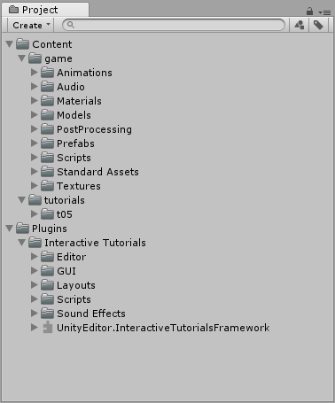
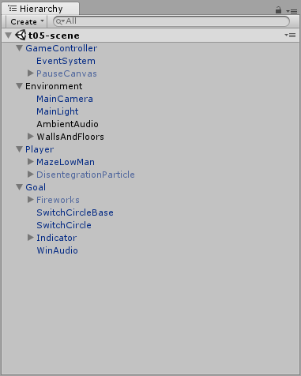
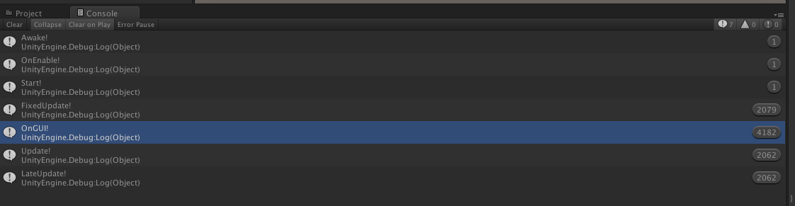
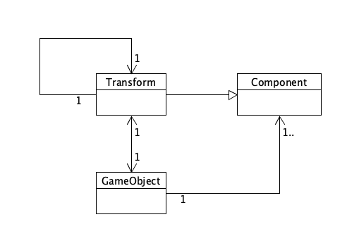

## 一、简答题

#### 1. 解释游戏对象（GameObjects）和资源（Assets）的区别与联系

资源表示游戏中能够使用的任何的物体、声音和脚本等，资源可以来自文件的导入以及unity自身的创建。游戏对象是表示文字、道具以及场景的基础物件。

游戏对象自身的功能的实现有限，但是他可以通过作为游戏组件的容器来实现实际的功能。

两者之间的层次不一样，游戏对象可以由多个资源或游戏对象组成，而资源是游戏对像的基础，同时也是游戏对象在游戏中的具体体现。

#### 2. 下载几个游戏案例，分别总结资源、对象组织的结构（指资源的目录组织结构与游戏对象树的层次结构）

以上是下载的一个游戏例子的资源目录，Images用于存放游戏中要用到的图片，Prefabs用于存放要用到的预设，Scenes用于存放要用到的游戏场景，Scripts用于存放驱动游戏运行的脚本，Audio用于存放游戏中的音频，Anitmations存放动作脚本，另外还有一些额外添加的插件。

然后是游戏对象结构树。

可以看到上面有玩家、球门、环境以及游戏控制器四个一层的对象，然后子对象再细化一层的对象。

#### 3. 编写一个代码，使用 debug 语句来验证 MonoBehaviour基本行为或事件触发的条件

~~~c#
using System.Collections;
using System.Collections.Generic;
using UnityEngine;
 
public class Test : MonoBehaviour {
 
	void Awake () {
		Debug.Log ("Awake");
	}
	// Use this for initialization
	void Start () {
		Debug.Log("Start");
	}
	
	void Update () {
		Debug.Log("Update");
	}
 
	void FixedUpdate(){
		Debug.Log ("FixedUpdate");
	}
 
	void LateUpdate(){
		Debug.Log ("LateUpdate");
	}
 
	void OnGUI(){
		Debug.Log ("GUI");
	}
 
	void OnDisable(){
		Debug.Log ("Disable");
	}
 
	void OnEnable(){
		Debug.Log ("Enable");
	}
}

~~~

* 可以看到OnEnable、Start、Awake函数都只执行了一次，FixedUpDate、OnGUI、update、LateUpdate执行了多次，其中OnGUI执行的次数是其他的两倍。

#### 4. 查找脚本手册，了解GameObject,Transfrom,Component对象

* 分别翻译官方对三个对象的描述（Description）

  GameObject 

  官方手册：

  GameObjects are the fundamental objects in Unity that represent characters, props and scenery. They do not accomplish much in themselves but they act as containers for Components, which implement the real functionality.

  翻译：游戏对象是表示文字、道具以及场景的基础物件。游戏对象自身的功能的实现有限，但是他可以通过作为游戏组件的容器来实现实际的功能。

  Transform ：

  官方手册：The Transform component determines the Position, Rotation, and Scale of each object in the scene. Every GameObject has a Transform.

  翻译: 转换部件决定了场景中物体的位置、旋转以及缩放成都，所有的游戏对象都有一个转换部件。

  Component ：

  官方手册：Components are the nuts & bolts of objects and behaviors in a game. They are the functional pieces of every GameObject.

  翻译: 组件是游戏中对象和行为的基础，也是每个游戏对象的基础。

* 描述下图中 table 对象（实体）的属性、table 的 Transform 的属性、 table 的部件

  table对象的属性：

  1. activeInHierarchy：GameObject是否处于active显示状态
  2. Static：游戏对象是否为静态
  3. layer：游戏对象所在的图层。
  4. scene：游戏对象所属的场景
  5. tag：游戏对象的标签
  6. transform：附加到这个GameObject的旋转

  table的Transform的属性：

  1. Position：table的位置信息
  2. Rotation：table的旋转信息
  3. Scale：table的缩放信息

  table的部件有：

  1. Mesh Filter：把Mesh扔给MeshRender将模型或者说是几何体绘制显示出来
  2. Box Collider：用于碰撞检测
  3. Mesh Renderer：用于把网格渲染出来的组件

* 用 UML 图描述 三者的关系（请使用 UMLet 14.1.1 stand-alone版本出图）

  

#### 5. 整理相关学习资料，编写简单代码验证以下技术的实现

* 查找对象

~~~c#
1. 通过名字查找对象
GameObject toFind = GameObject.Find("objname");
2. 通过标签查找
GameObject toFind = GameObject.FindWithTag("tagname");
3. 通过标签查找多个对象
GameObject[] toFind = Gameobject.FindGameObjectsWithTag("tagname");
~~~

* 添加子对象

~~~c#
sonObject.transform.parent = parentObject.transform;
~~~

* 遍历对象树

~~~c#
foreach (GameObject x in objectArray) {
    //visit(x);
}
~~~

* 清除所有子对象

~~~c#
foreach (GameObject x in objectArray) {
    GameObject.Destroy (x);
}
~~~

#### 6. 资源预设（Prefabs）与 对象克隆 (clone)

* 预设（Prefabs）有什么好处？

  预设类类似于面向对象中的类，通过预设每个对象就像代码中通过类创建对象，这样子我们就可以更加方便地去修改类来修改这一系列的对象了，跟代码一样，只修改它们父类我们就可以对一系列的对象来修改了。

* 预设与对象克隆 (clone or copy or Instantiate of Unity Object) 关系？

  预设在修改预设的时候，所有相关的对象的属性都会因此而发生改变；而克隆之间的对象除了当前的属性一样以外没有任何的联系，修改其中一个另外一个不会因此而收到影响。

* 制作 table 预制，写一段代码将 table 预制资源实例化成游戏对象

  ~~~c#
  public GameObject table;
  void Start () {
      GameObject table2 = (GameObject)Instantiate(table.gameObject);
  }
  ~~~

  

#### 7. 尝试解释组合模式（Composite Pattern / 一种设计模式）。使用 BroadcastMessage() 方法向子对象发送消息

组合模式又叫部分整体模式，用于把一组相似的对象当作一个单一的对象。组合模式依据树形结构来组合对象，用来表示部分以及整体层次。这种类型的设计模式属于结构型模式，它创建了对象组的树形结构。

BoadcastMessage用法是传入函数名字以及其他参数来触发子对象的函数。

* 父对象

~~~
public class father : MonoBehaviour {
    void Start () {
        this.BroadcastMessage("message", "hello");
    }
}

~~~

* 子对象

~~~
public class child : MonoBehaviour {
    void message(string msg) {
        Debug.Log("Father say: " + msg);
    }
}
~~~

## 二、编程实践，小游戏

* 游戏内容： 井字棋 或 贷款计算器 或 简单计算器 等等
* 技术限制： 仅允许使用 **IMGUI** 构建 UI
* 作业目的：
  * 了解 OnGUI() 事件，提升 debug 能力
  * 提升阅读 API 文档能力

1. 根据要求仅使用IMGUI构建，所以直接写代码以及导入资源就可以了。

2. 首先导入等一下所需要的图片，这里要导入的是棋子的图片，分别是黑色和白色的棋子，给双方玩家使用。右健点击unity3d的project工具栏的asset，选择导入新的资源，选择需要的棋子图片导入。

3. 然后新建一个c#脚本，开始输入代码。

4. 首先创建两个public变量，以提供链接上面导入的棋子图片。同时建立好一个存放棋盘信息的二位数组，分别表示有棋子和没有棋子，同时还有一个用于记录回合轮转的变量turn。

~~~c#
public Texture white;
public Texture black;
int[,] color = new int[3,3];
int turn = 1;
	/*
	 * color
	 * 0: 区域未占领
	 * 1: 区域白色
	 * 2: 区域黑色
	 *
	 * turn
	 * 1: 白色回合
	 * 2: 黑色回合
	 * 
	 * win
	 * 1: 白色赢
	 * 2: 黑色赢
	 * 3：平局
	 */
~~~

5. 然后在OnGUI创建好用户的界面，这里的OnGUI函数在每一帧里都会调用，在这里可以创建我们所需要的用户界面。在OnGUI上首先创建好一个字体样式，使用的是GUIStyle类，这里设置了红色以及20pt的字体大小。

~~~c#
GUIStyle fontStyle = new GUIStyle();  
fontStyle.normal.background = null;   
fontStyle.normal.textColor= new Color(1, 0, 0);    
fontStyle.fontSize = 20; 
~~~

6. 然后是创建按钮，首先是开始以及重启游戏的按钮，按下后会触发init函数，init函数主要用于变量的初始化，分别是将回合轮转为白色先，另外将棋盘的每个值都设置为零，也就是没有棋子占领的状态。

~~~c#
if (GUI.Button (new Rect (250, 125, 150, 50), "Start")) {
			init();
}
...
void init() {
		turn = 1;
		for (int i = 0; i < 3; i ++)
			for (int j = 0; j < 3; j ++)
				color[i, j] = 0;
	}
~~~

7. 接着要创建游戏的界面，用的是GUI中的按钮部件，这里需要提供好按钮的内容，用图片或者是文本。根据棋盘数组color每个位置的数值来设置按钮的内容，如果有棋子，就使用对应棋子的图片；如果没有棋子那么就使用空文本，使得按钮没有内容。同时在color中记录为没有棋子的按钮，还要添加一个响应的语句，根据当前turn的值判断是谁的回合，然后将对应的color数组的值设置为对应棋子的值。

~~~c#
for (int i = 0; i < 3; i ++) {
			for (int j = 0; j < 3; j ++) {
				if (color[i, j] == 1) {
					GUI.Button(new Rect(250 + 50 * i, 205 + 50 * j, 50, 50), white);
				} else if (color[i, j] == 2) {
					GUI.Button(new Rect(250 + 50 * i, 205 + 50 * j,50,50), black);
				} 
				else if (GUI.Button(new Rect(250 + 50 * i, 205 + 50 * j, 50, 50), "")) {
					if (win == 0) {
						if (turn == 1) color[i, j] = 1;
						if (turn == -1) color[i, j] = 2;
						turn *= -1;
					}
				}
			}
		}
~~~

8. 另外还要在每一次操作中判断游戏是否已经结束，这里使用一个switch语句以及一个test函数。test函数用于判断是否已经满足游戏结束的条件，根据记录在color数组中的值来判断，依次判断垂直方向，水平方向以及斜线是否有三个相同的棋子，如果有就返回相应棋子的值。同时在最后还要判断是否还有位置可以放棋子，如果不能放棋子，也没有三个连续相同的棋子，那么就可以判断为是平局，返回平局的值3。如果上述条件的不符合那么久返回0，游戏继续进行。

~~~c#
	int Test() {
		//垂直方向检测
		for (int i = 0; i < 3; i ++)
			if (color[i, 0] == color[i, 1] && color[i, 0] == color[i, 2] && color[i, 0] != 0)
				return color[i, 0];
		//水平方向检测
		for (int j = 0; j < 3; j ++)
			if (color[0, j] == color[1, j] && color[2, j] == color[0, j] && color[0, j] != 0)
				return color[0, j];
		//斜线检测
		if (color[1, 1] != 0 && color[0, 0] == color[1, 1] && color[2, 2] == color[1, 1])
			return color[1, 1];
		//斜线检测
		if (color[1, 1] != 0 && color[0, 2] == color[1, 1] && color[2, 0] == color[1, 1]) 
			return color[1, 1];
		//判断是否还有位置
		for (int i = 0; i < 3; i ++) 
			for (int j = 0; j < 3; j ++) 
				if (color[i, j] == 0) return 0;
		//平局返回
		return 3;
	}
~~~

9. 最后如果游戏结束后，要根据Test()返回的值来输出游戏的结果，输出用的是GUI的label类，用于图片或者文字的显示，这里传入一个新建立的长方形对象，同时传入表达游戏结果的字符串和之前创建好的fontStyle字体样式。

~~~c#
int win = Test();

		switch (win) {
		case 1:
			GUI.Label (new Rect (250, 180, 50, 50), "白色赢!", fontStyle);
			break;
		case 2:
			GUI.Label (new Rect (250, 180, 50, 50), "黑色赢!", fontStyle);
			break;
		case 3:
			GUI.Label (new Rect (250, 180, 50, 50), "平局!", fontStyle);
			break;
		}
~~~

10. 游戏截图以及视频地址

