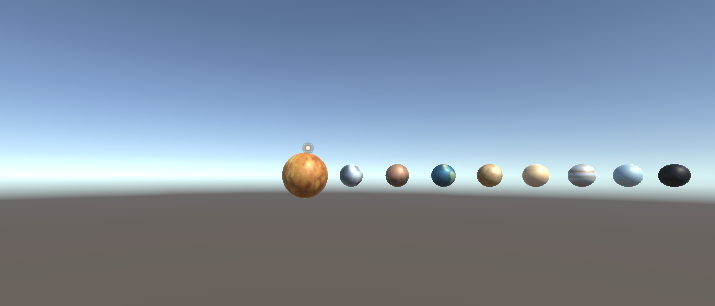

##	1、简答题

1. 游戏对象运动的本质是什么？

* 游戏对象运动的本质是游戏对象的位置坐标、角度方向随着每一帧的改变

2. 请用三种方法以上方法，实现物体的抛物线运动。（如，修改Transform属性，使用向量Vector3的方法…）

* 修改Transform位置属性

~~~c#
    private float vx = 5f, vy = 0f;
    void Update()
    {
        Vector3 po = new Vector3(Time.deltaTime * vx, Time.deltaTime * vy, 0);
        this.transform.position += po;
        vy = vy - 10 * Time.deltaTime;
    }

~~~

* 使用Translate函数

~~~c#
    private float vx = 5f, vy = 0f;
    void Update()
    {
        Vector3 po = new Vector3(Time.deltaTime * vx, Time.deltaTime * vy, 0);
        this.transform.Translate(po);
        vy = vy - 10 * Time.deltaTime;
    }
~~~

* 使用Lerp函数

~~~c#
    private float vx = 5f, vy = 0f;
    void Update()
    {
        Vector3 po = new Vector3(Time.deltaTime * vx, Time.deltaTime * vy, 0);
        transform.position = Vector3.Lerp(transform.position, transform.position + po, 1);
        vy -= 10 * Time.deltaTime;
    }
~~~

3. 写一个程序，实现一个完整的太阳系， 其他星球围绕太阳的转速必须不一样，且不在一个法平面上。

* 首先先建立好九个球体，并且设置好球体的位置以及摄像头的位置

  

* 然后准备好球体的材质图片，同时把图片拖到对应的球体上。

* 贴好材质后的效果如下。

* 接下来要建立好每个球体的运行脚本，通过以下的代码，可以在界面上简单输入每个球体的公转自转速度，以及公转的轴来实现太阳系的运动。

~~~c#
	public Transform sun;
	public float gv;       
	public float zv;        
	public float ry, rz;

	void Start() {

	}

	void FixedUpdate () {
		this.transform.RotateAround (sun.position, new Vector3 (0, ry, rz), gv * Time.deltaTime);  
		this.transform.Rotate (Vector3.up * zv * Time.deltaTime);   
	}  
}
~~~

* 把脚本拖到每一个小球上，同时设置好每个小球自转的中心球体以及其自转公转速度、自转轴，就完成了。

## 2.编程实践--*Priests and Devils*

1. 列出游戏中提及的事物

> Priest 牧师
>
> Devils 恶魔
>
> Boat 船
>
> Coast 河岸

2. 用表格列出玩家的动作表（规则表）

   |       规则       | 条件                             | 结果                         |
   | :--------------: | -------------------------------- | ---------------------------- |
   |   玩家点击小船   | 船上至少有一个人物               | 船和船上的人移动到另外一边   |
   | 玩家点击岸上人物 | 人物所在的河岸有小船，小船有空位 | 点击的岸上人物移动到小船上   |
   | 玩家点击船上人物 | 条件船上有人                     | 船上的人移动到小船所靠的岸上 |

3. 将游戏中的对象做成预制

* 按照要求把对象做成预制后放在asset/Resources中的Prefabs文件夹中。

### 具体代码

1. 首先是程序的文件列表，上面的每个对象都具有一个控制对象以及一个model对象，控制对象实现与玩家交互的接口，模型对象的功能是储存、管理游戏对象，以及其空间关系，主要体现在成员函数大多都为set以及get函数。另外还有两个GUI类提供用户直接使用的接口、Move类实现各种对象的运动、以及Director和MySceneController实现对总体对象进行创建以及管理。

Move类：

* 根据设计模式的思想，每个物体都有相似的移动操作，由一个点移动到另外一个点，所以我们可以将这个方法抽象出来，从而减少代码的处理量。这里的Move类就是这样设计的，他继承了MonoBehaviour从而使得游戏中每个添加了这个脚本文件的游戏对象可以通过update函数，实现运动的能力。这里主要给出类的成员变量、函数名以及函数的功能：

~~~c#
	readonly float move_speed = 20;
	private int move_to_where; //记录移动到那一边， 1 为船上， 2为岸上
	private Vector3 dest;	//移动的目标
	private Vector3 middle;
  public static int can_move = 0; // 记录是否可以移动对象，1为不可以，0为可以
	void Update(){
		//使用MoveToWards函数实现位置的改变
	}
	public void SetDestination(Vector3 _dest){
		//给出需要移动到的坐标，提供给update函数
	}
	public void reset(){
		//重新设置Move类
	}
~~~

Boat对象

* BoatControl类：
* BoatControl主要实现的是船的行为，根据上面的分析可以知道，船主要用于承载并且运输人物，所以船需要有以下几个方法，getOnBoat（人物上船）、getOffBoat（人物下船）、boatMove（船只移动），同时因为采用的是mvc模式，所以船的控制器还要管理好船的model，所以还要有一个model的成员变量。

~~~c#
public class BoatController {
	BoatModel model;
	readonly Move move;
	public BoatController {
		//创建好船的model对象
		//给游戏中的船对象添加Move脚本，并初始化move对象
	}
	public void getOnBoat(CharacterController cha){
		//利用model将cha人物对象添加到船上
	}
	public CharacterController getOffBoat(string name){
		//从model中将名字为name的人物对象去除,并且将对应去除的人物返回
	}
	public void boatMove() {
		//利用move对象成员比昂两中国呢的SetDestination函数来实现位置的移动
	}
~~~

* Boatmodel类
* Boatmodel的操作就多许多，首先是要存放的人物的control对象，同时还要记录好船的位置以及人、船会使用到的位置，同时还有许多的get、set函数提供给其他control对象使用，下面是类中一些较为重要的方法和变量。

~~~c#
public class BoatModel{
	readonly GameObject boat; //船的游戏对象
	readonly Vector3 fromPos = new Vector3 (5, 1, 0); //船在目标岸边停靠的位置
	readonly Vector3 toPos = new Vector3 (-5, 1, 0); //船在原岸边停靠的位置
	readonly Vector3[] from_pos;  //记录船在from位置时人可以站的位置
	readonly Vector3[] to_pos;    //记录船在to位置时人可以站的位置
	private int TFflag;  //记录船在原(from)位置还是目标(to)位置
	private CharacterController[] passenger = new CharacterController[2];
	
	public BoatModel(){
		//1）设置好船的位置
		//2）创建好船对象，以及加载的游戏画面中
		//3）建立好各种位置的坐标
	}
  public Vector3 getToPos(){
    //返回船在目标岸边停靠的位置
  }
  public Vector3 getFromPos(){
    //返回船在原岸边停靠的位置
  }
  public bool isEmpty(){
    //判断船只上是否有人，用于判定船是否能动
  }
  public Vector3 getEmptyPosition() {
    //返回船上一个空的位置坐标，用于人物的上船
  }
  public CharacterController getPassenger(string name) {
    //通过循环遍历列表，返回名字与name匹配的人物对象
  }
  public getCaracterNum() {
    //返回船上牧师以及恶魔的数量，用于判断输赢
  }
  public reset() {
    //重新设置船上的人物
  }
}
~~~

Coast对象：

* Coastcontrol类：
* 岸并没有很多的动作，其主要是作为人物的载体出现的，同时岸边也有着记录人物数量的责任，另外有一点要注意的是，左岸（to）与右岸（from）的坐标、性质等都有区别，所以这两种情况需要区别开来。类中的方法和成员变量如下。

~~~c#
public class CoastController{
	CoastModel model;
	public Coast
	public CoastCOntroller(int side) {
		//根据传入的side判断创建的是那一边的岸
		//创建好岸边的model对象
	}
	public void getOnCoast(CharacterController cha) {
		//上岸，先调用model函数在岸上找一个空的位置
		//然后，利用model对象将参数中的人物对象添加到岸边
	}
	public void getOffCoast(string name) {
		//利用model对象找到名字与name匹配的人物对象的索引
		//利用索引以及model对象，将对应的人物对象从该岸边中取出
	}
	public void reset() {
		model.reset();
	}
}
~~~

* Coastmodel类:

* 岸的model类主要是岸上的人物对象、空间位置的记录、管理。

~~~c#
public class CoastModel {
	private CharacterController[] character; //岸上的人物对象
	readonly Vector3[] postion;	//岸上位置的坐标
	readonly Vector3 from_pos = new Vector3(9,1,0); //from 岸的位置
	readonly Vector3 to_pos = new Vector3(-9,1,0);  //to 岸的位置
	GameObject coast;  //岸游戏对象
	int TFflag;  //1: from， -1: to， 用于判断是那一边的岸
	public CoastModel() {
		//初始化好各种位置坐标
		//创建好岸边的游戏对象
	}
	public int getIndexByName(string name) {
		//遍历人物列表，返回名字与name匹配的游戏对象
	}
	public int getEmptyIndex() {
		//遍历数组，返回岸上第一个空的位置索引
	}
	public Vector3 getEmptyPosition {
		//调用getEmptyIndex找到索引
		//根据TFflag找到坐标并返回
	}
	public int[] getCharacterNum() {
		//遍历数组，统计其中的恶魔以及牧师的数量
		//返回
	}
	public void setCharacter(int index, CharacterController cha) {
		//根据索引将cha人物对象添加到列表中
		//用于前面CoastController上岸下岸方法
	}
~~~

Character对象：

- Charactercontrol类：
- 人物的control类包括了人物的所有操作的方法，同时也有提供其他类使用的model接口，用于数据的查询、修改。

~~~c#
public class CharacterController {
	Move move;
	ClickGUI clickgui;
	private CoastController coastcontroller;
	private CharacterModel charactermodel;
	
	public CharacterController(string name) {
		//创建好move、clickgui、model对象
	}
	public void moveToPosition(Vector3 dest) {
		//使用move对象实现位置的移动
	}
	public void getOnBoat(BoatController boat) {
		//将人物移到船上，设置好人物的父对象以及其状态
		coastcontroller = null;
		charactermodel.setObjectParent (boat.getGameObject ().transform);
		charactermodel.setState (true);
	}
	public void getOnCoast(CoastController coast_to) {
		//上岸，将人物移到岸上，将人物的父对象设置为空，并且将其状态设置为岸上
		coastcontroller = coast_to;
		charactermodel.setObjectParent (null);
		charactermodel.setState (false);
	}
	public bool isName(string objectname) {
		//调用model来判断对象的名字是否为objectname
		return charactermodel.getName() == objectname;
	}
	public bool isType(int type) {
		//调用model来判断对象是恶魔还是牧师
		return charactermodel.getType() == type;
	}
}
~~~

* Charactermodel类:

* model类主要是存放以及处理游戏中的对象以及空间信息。

~~~c#
public class CharacterModel {
	GameObject character;  //人物的游戏对象
	int Ctype;						//人物的类型，0:牧师，1:恶魔
	private bool Onboat;  //人物是否在船上，0:不在船上，1：在船上
	public CharacterModel(string name) {
		//根据传入的name设置好人物的类型，并且加载好对应的游戏对象
		if(Myname == "priest"){
			character = Object.Instantiate(Resources.Load("Prefabs/Priest", typeof(GameObject)), Vector3.zero, Quaternion.identity,null) as GameObject;
			Ctype = 0;
		}
		else{
			character = Object.Instantiate(Resources.Load("Prefabs/Devil", typeof(GameObject)), Vector3.zero, Quaternion.identity,null) as GameObject;
			Ctype = 1;
		}
	}
	public void setName(string name) {
		//设置人物的名字
		character.name = name;
	}
	public void setPosition(Vector3 postion){
		//设置游戏对象所在的位置
		character.transform.position = postion;
	}
	public int getType(){
		//获得游戏对象的类型
		return Ctype;
	}
	public void setObjectParent(Transform objtransform) {
		//设置父对象
		character.transform.parent = objtransform;
	}
	public void setState(bool state) {
		//设置游戏对象的状态，1为在船上，0为在岸上
		Onboat = state;
	}
	public GameObject getObject() {
		//返回游戏对象
		return character;
	}
	public bool isOnBoat(){
		//返回是否在船上
		return Onboat;
	}
}
	
~~~

ClickGUI类

* 该类的作用是给每个对象添加一个点击相应，用于向Controller类传递用户点击的信息。

~~~c#
public class ClickGUI : MonoBehaviour {

	// Use this for initialization
	UserAction action;
	CharacterController character;

	public void setController(CharacterController tem){
		character = tem;
	}
	void Start(){
		action = Director.get_Instance ().curren as UserAction;
	}
	void OnMouseDown(){
	//用户点击该对象后执行该函数
		if (UserGUI.outcome != 0) //游戏结束后不会再响应
			return;
		if (gameObject.name == "boat") { //判断点击的对象是船还是人物
			action.moveboat ();
		} else {
			action.isClickChar (character);
		}
	}
}
~~~

MySceneController类

* 各游戏对象类的创建，在全局上控制所有对象，并且对用户产生的动作进行处理以及响应。

~~~c#
public class MySceneController : MonoBehaviour, SceneController, UserAction{
	readonly Vector3 water_pos = new Vector3 (0, 0.5f, 0);
	UserGUI user; //用户按钮
	public CoastController coast_from; //河岸的控制对象
	public CoastController coast_to;
	public BoatController boat;  //船的控制对象
	private List<CharacterController> team; //存放人物控制对象

	void Awake(){
		//
		Director director = Director.get_Instance ();
		director.curren = this;
		user = gameObject.AddComponent<UserGUI> () as UserGUI;
		team = new List<CharacterController>();
		loadResources ();
	}
	public void loadResources() {
		//加载资源
		GameObject water = Instantiate (Resources.Load ("Prefabs/water", typeof(GameObject)), water_pos, Quaternion.identity, null) as GameObject;
		water.name = "water";

		coast_from = new CoastController (1);
		coast_to = new CoastController (-1);
		boat = new BoatController ();
		//创建好牧师与恶魔对象，并设置好唯一的名字
		for (int i = 0; i < 3; i++) {
			CharacterController tem = new CharacterController ("priest");
			tem.getCharacterModel().setName ("priest" + i);
			tem.getCharacterModel().setPosition (coast_from.getCoastModel().getEmptyPosition ());
			tem.getOnCoast (coast_from);
			coast_from.getOnCoast (tem);
			team.Add (tem);
		}

		for (int i = 0; i < 3; i++) {
			CharacterController tem = new CharacterController ("devil");
			tem.getCharacterModel().setName ("devil" + i);
			tem.getCharacterModel().setPosition (coast_from.getCoastModel().getEmptyPosition ());
			tem.getOnCoast (coast_from);
			coast_from.getOnCoast (tem);
			team.Add (tem);
		}
	}
	public void moveboat(){
		//船要有人才能移动
		if (boat.getModel().isEmpty ())
			return;
		boat.boatMove ();
		//每次移动完检查游戏是否已经结束
		UserGUI.outcome = checkGameOver();
	}
	public void isClickChar (CharacterController tem_char){
		//点击的是人物，判断是否移动人物
		if (Move.can_move == 1) //暂停或者是游戏已经结束
			return;
		if (tem_char.getCharacterModel().isOnBoat ()) {
			//在船上就移动到岸上
			CoastController tem_coast;
			if (boat.getModel().getTFflag () == -1) {
				tem_coast = coast_to;
			} else {
				tem_coast = coast_from;
			}
			boat.getOffBoat (tem_char.getCharacterModel().getName ());
			tem_char.moveToPosition (tem_coast.getCoastModel().getEmptyPosition ());
			tem_char.getOnCoast (tem_coast);
			tem_coast.getOnCoast (tem_char);
		} else {
			//在岸上就移动到船上
			CoastController tem_coast2 = tem_char.getCoastController ();
			if (boat.getModel().getEmptyIndex () == -1)
				return;
			if (boat.getModel().getTFflag () != tem_coast2.getCoastModel().getTFflag ())
				return;
			tem_coast2.getOffCoast (tem_char.getCharacterModel().getName());
			tem_char.moveToPosition (boat.getModel().getEmptyPosition ());
			tem_char.getOnBoat (boat);
			boat.getOnBoat (tem_char);
		}
		//check whether game over;
		UserGUI.outcome = checkGameOver();
	}
	public void restart(){
		//调用各个对象的复位函数
		boat.reset ();
		coast_from.reset ();
		coast_to.reset ();
		foreach (CharacterController i in team) {
			i.reset ();
		}
		Move.can_move = 0;
	}

	private int checkGameOver(){
		//判断游戏是否已经结束
		if (Move.can_move == 1)
			return 0;
		int from_priest = 0;
		int from_devil = 0;
		int to_priest = 0;
		int to_devil = 0;

		//分别求出两岸边的恶魔和牧师的数量
		int[] from_count = coast_from.getCoastModel().getCharacterNum ();
		from_priest = from_count [0];
		from_devil = from_count [1];

		int[] to_count = coast_to.getCoastModel().getCharacterNum ();
		to_priest = to_count [0];
		to_devil = to_count [1];

		if (to_devil + to_priest == 6)
			//所有的恶魔以及牧师都移动到了另外一边，游戏赢了
			return 1;
		int[] boat_count = boat.getModel().getCharacterNum();
		if (boat.getModel().getTFflag () == 1) {
			//判断输赢是还要把船上的人也计算在内
			from_priest += boat_count [0];
			from_devil += boat_count [1];
		} else {
			to_priest += boat_count [0];
			to_devil += boat_count [1];
		}
		if (from_priest < from_devil && from_priest > 0)
			//右边的恶魔大于牧师，游戏输了
			return -1;
		if(to_priest < to_devil && to_priest > 0)
			//左边的恶魔大于牧师，游戏输了
			return -1;
		
		return 0;//游戏继续
	}

}
~~~

UserGUI

* 用于创建用户点击的游戏界面，这里具体有重新开始游戏的按钮，以及显示游戏结果信息。

~~~c#
public class UserGUI : MonoBehaviour {
	private UserAction action;  //MySceneController中与用户动作相关的接口
	private GUIStyle MyStyle;   //字体样式
	private GUIStyle MyButtonStyle;
	public static int outcome; //游戏当前的结果状态，0: 游戏未结束，1: 玩家胜利， -1: 玩家失败

	void Start(){
		//获得UserAction接口对象，从而能够使用MySceneContoller中对应的方法
		action = Director.get_Instance ().curren as UserAction;

		MyStyle = new GUIStyle ();
		MyStyle.fontSize = 40;
		MyStyle.normal.textColor = new Color (255f, 0, 0);
		MyStyle.alignment = TextAnchor.MiddleCenter;

		MyButtonStyle = new GUIStyle ("button");
		MyButtonStyle.fontSize = 30;
	}
	void reStart(){
		//显示从新开始按钮
		if (GUI.Button (new Rect (Screen.width/2-Screen.width/8, Screen.height/2+100, 150, 50), "Restart", MyButtonStyle)) {
			outcome = 0;
			action.restart ();
			Move.can_move = 0;
		}
	}

	void OnGUI(){
		reStart (); //显示restart按钮
		if (outcome == -1) {
			//玩家失败游戏结束
			GUI.Label (new Rect (Screen.width/2-Screen.width/8, 50, 100, 50), "Game Over!!!", MyStyle);
			reStart ();
		} else if (outcome == 1) {
			//玩家胜利
			GUI.Label (new Rect (Screen.width/2-Screen.width/8, 50, 100, 50), "You Win!!!", MyStyle);
			reStart ();
		}
	}
}
~~~

Director类

* 创建MySceneController对象，并且提供给其他类使用。

~~~c#
public class Director: System.Object
{
	private static Director _instance;
	public SceneController curren{ get; set;} //MySceneController对象，并且自动生成get、set函数
	public static Director get_Instance(){ //返回该对象
		if (_instance == null) //如果Director对象还没有创建就创建对象
		{
			_instance = new Director();
		}
		return _instance;
	}
}
~~~

游戏图片以及视频地址

* 
* 