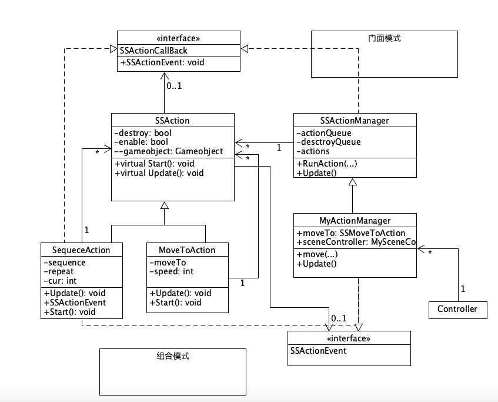

# 牧师与魔鬼(动作分离版)

* 牧师与魔鬼 动作分离版
  - 【2019新要求】：设计一个裁判类，当游戏达到结束条件时，通知场景控制器游戏结束

#### 新版与旧版的区别

* 在旧版本中，一样有将动作抽象分离出来成为一个Move类，从而减少代码的复杂度，但是这里要为每一个对象都创建一个move类，这样有点麻烦。这里参考了一下网上的先例，对动作分离进行进一步的改进。
* Move 类

~~~c#
	readonly float move_speed = 20;
	private int move_to_where; //记录移动到那一边， 1 为船上， 2为岸上
	private Vector3 dest;	//移动的目标
	private Vector3 middle;
  public static int can_move = 0; // 记录是否可以移动对象，1为不可以，0为可以
	void Update(){
		//使用MoveToWards函数实现位置的改变
	}
	public void SetDestination(Vector3 _dest){
		//给出需要移动到的坐标，提供给update函数
	}
	public void reset(){
		//重新设置Move类
	}
~~~


* 在新版本中，为了方便动作的管理，大致的思路是创建一个专门创建以及管理动作的类，把游戏里的动作实现抽离出来，另外写一个动作管理器来提供接口进行对象动作的增删。

#### 具体实现

* 首先是最基础的SSAction类，该类是所有动作的基类。参考前面师兄的设计，将SSAction类继承ScriptableObject类，这样就可以使该类使用时不用绑定特定的游戏对象，这样有助于减少反复的脚本添加以及符合动作类的特性，每一个游戏对象都有可能会用到。

~~~c#
public class SSAction : ScriptableObject    
{
	public GameObject gameobject;  //动作对象
	public Transform transform;    	//动作对象的transform
	public ISSActionCallback callback;     //回调函数

    public bool enable = true;     //是否正在运行
    public bool destroy = false;   //是否需要被销毁

    public virtual void Start() {}

    public virtual void Update() {}
}
~~~

* SSAction类
* 然后是两个对SSAction类的实现，首先是MoveToAction类，直接作用于目标对象，将目标对象移动到目的位置。该类具有static方法SSMoveToAction，每次有调用该函数是都会创建并且返回一个用于移动的对象。update函数就是具体移动的实现。

~~~c#
public class SSMoveToAction : SSAction                        //移动
{
	public Vector3 dest;        //移动到的目的地
	public float speed;           //移动速度

	private SSMoveToAction() { }
	public static SSMoveToAction GetSSAction(Vector3 dest, float speed) {
		SSMoveToAction action = ScriptableObject.CreateInstance<SSMoveToAction>();//创建实例
		action.dest = dest;
		action.speed = speed;
		return action;
	}

	public override void Update() {
		this.transform.position = Vector3.MoveTowards(this.transform.position, dest, speed * Time.deltaTime);
		if (this.transform.position == dest)
		{
			this.destroy = true;
			this.callback.SSActionEvent(this);      //告诉动作管理或动作组合这个动作已完成
		}
	}
	public override void Start() {
		//移动过程无动作
	}
}
~~~

* SwquenceAction
* 然后是创建一系列移动的类，用于人物的移动，因为人需要在岸上走一段距离后再上船。该函数会处理完一个动作后再处理另外一个动作，先处理人在岸上走再处理人上船。

~~~c#
public class SequenceAction : SSAction, ISSActionCallback {
	public List<SSAction> sequence;    //一系列动作
	public int repeat = -1;            //是否循环的标志，-1表示无限循环
	public int cur = 0;              //当前做的动作的索引

	public static SequenceAction GetSSAcition(int repeat, int start, List<SSAction> sequence) {
		SequenceAction action = ScriptableObject.CreateInstance<SequenceAction>(); //创建实例
		action.repeat = repeat;
		action.sequence = sequence;
		action.cur = start;
		return action;
	}

	public override void Update() {
		if (sequence.Count == 0) return; //没有动作则返回
		if (cur < sequence.Count) {
			sequence[cur].Update();     //调用一系列动作
		}
	}

	public void SSActionEvent(SSAction source, SSActionEventType events = SSActionEventType.Competeted,
		int intParam = 0, string strParam = null, Object objectParam = null) {
		source.destroy = false;          
		cur ++;
		if (cur >= sequence.Count) {
			cur = 0;
			if (repeat > 0) 
				repeat --;
			if (repeat == 0) {
				this.destroy = true;               //组合完成后，删除动作
				this.callback.SSActionEvent(this); //告诉组合动作的管理对象组合做完了
			}
		}
	}

	public override void Start() {
		foreach (SSAction action in sequence) {
			action.gameobject = this.gameobject;
			action.transform = this.transform;
			action.callback = this;                //组合动作的每个小的动作的回调是这个组合动作
			action.Start();
		}
	}

	void OnDestroy() {
		
	}
}

~~~

* SSActionManager类
* 管理以上的两个动作的类对象，决定了下一个执行的动作，还有对上面动作的存放、判断以及删除，同时实现ISSActionCallback接口，从而能知道动作是否已经完成。

```c#
public class SSActionManager : MonoBehaviour, ISSActionCallback                      //action管理器 
{
	private Dictionary<int, SSAction> actions = new Dictionary<int, SSAction>();    //将执行的动作的字典集合
	private List<SSAction> actionQueue = new List<SSAction>();                       //等待去执行的动作列表
	private List<int> destroyQueue = new List<int>();                              //等待删除的动作的key                

	protected void Update() {
		foreach (SSAction ac in actionQueue) {
			//存放动作
			actions[ac.GetInstanceID()] = ac;                                     
		}
		actionQueue.Clear();

		foreach (KeyValuePair<int, SSAction> kv in actions)	{  //判断动作是否需要销毁
			SSAction ac = kv.Value;
			if (ac.destroy) {
				destroyQueue.Add(ac.GetInstanceID());
			}
			else if (ac.enable) {
				ac.Update();
			}
		}

		foreach (int key in destroyQueue) {  //销毁完成后的动作
			SSAction ac = actions[key];
			actions.Remove(key);
			DestroyObject(ac);
		}
		destroyQueue.Clear();
	}

	public void RunAction(GameObject gameobject, SSAction action, ISSActionCallback manager) {
		action.gameobject = gameobject;
		action.transform = gameobject.transform;
		action.callback = manager;
		actionQueue.Add(action);
		action.Start();
	}

	public void SSActionEvent(SSAction source, SSActionEventType events = SSActionEventType.Competeted,
		int intParam = 0, string strParam = null, Object objectParam = null) {
		//游戏对象移动完成后没有的动作
	}
}
```

* MySceneActionManager类
* 用户直接使用的动作管理类，因为移动船与移动人物不同，前者直接移动，后者需要移动到岸边再上船，所以有moveBoat与moveCharacter两个函数，前者使用的是SSMoveToAction类进行一个移动，后者使用的是SequenceAction进行两个移动。

~~~c#
public class MySceneActionManager : SSActionManager  //本游戏管理器
{

	private SSMoveToAction moveboat;     //移动船到结束岸，移动船到开始岸
	private SequenceAction movech;

	public MySceneController sceneController;

	protected new void Start() {
		sceneController = (MySceneController)Director.get_Instance().curren;
		sceneController.actionManager = this;
	}
	public void moveBoat(GameObject boat, Vector3 dest, float speed) {
		moveboat = SSMoveToAction.GetSSAction(dest, speed);
		this.RunAction(boat, moveboat, this);
	}
	public void moveCharacter(GameObject ch, Vector3 middle, Vector3 dest,float speed) {
		//先到岸边，再上船
		SSAction action1 = SSMoveToAction.GetSSAction(middle, speed);
		SSAction action2 = SSMoveToAction.GetSSAction(dest, speed);
		movech = SequenceAction.GetSSAcition(1, 0, new List<SSAction>{action1, action2}); //船动作组合
		this.RunAction(ch, movech, this);
	}
}
~~~

* 除了新增了动作管理与创建的类外，还需要对原来的类进行一些改变，包括动作的使用方法，以及在控制类中创建一个动作管理对象。

* 人物移动使用方法。

~~~c#
actionManager.moveCharacter(charactermodel.getObject(), middle, dest, 25);
~~~

* 船移动方法

~~~c#
actionManager.moveBoat(model.getGameObject(), model.getFromPos(), 20);
~~~


#### UML图展示



从UML图中可以看到上面使用了组合模式以及门面模式，组合模式依据树形结构来组合对象，用来表示部分以及整体层次。门面模式提供一个统一的接口去访问子系统的多个不同的接口，它为动作管理系统中的一组接口提供一个统一的高层接口，使得系统更容易使用。