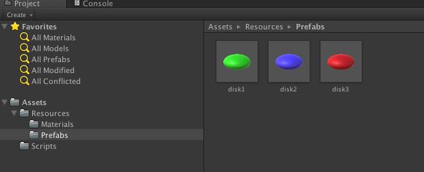
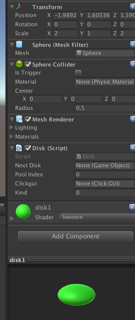
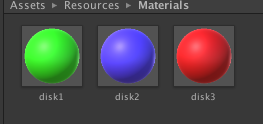
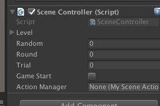
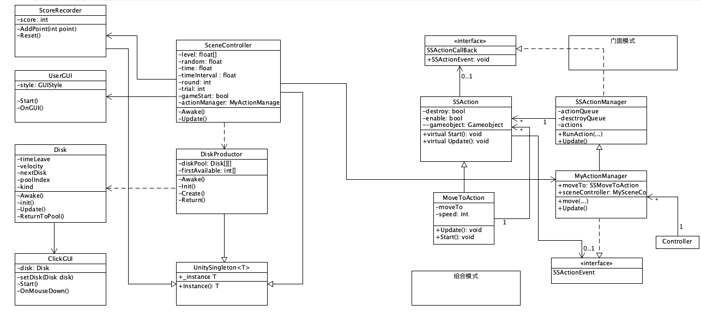

## 3dgame 作业5

#### 1. 作业内容

编写一个简单的鼠标打飞碟（Hit UFO）游戏

- 游戏内容要求：
  1. 游戏有 n 个 round，每个 round 都包括10 次 trial；
  2. 每个 trial 的飞碟的色彩、大小、发射位置、速度、角度、同时出现的个数都可能不同。它们由该 round 的 ruler 控制；
  3. 每个 trial 的飞碟有随机性，总体难度随 round 上升；
  4. 鼠标点中得分，得分规则按色彩、大小、速度不同计算，规则可自由设定。
- 游戏的要求：
  - 使用带缓存的工厂模式管理不同飞碟的生产与回收，该工厂必须是场景单实例的！具体实现见参考资源 Singleton 模板类
  - 近可能使用前面 MVC 结构实现人机交互与游戏模型分离

#### 2. 游戏配置

1. 游戏中共有三种飞碟，创建好三个飞碟的预制类。

2. 在三个预制类中分别添加Disk脚本，并且设置好每个预制类的大小。

3. 创建好三种飞碟不同的材质，并添加。

4. 创建一个空对象，并将SceneController添加到该对象中，即可运行。

#### 3. UML类图

* 这里用了许多上一次作业中设计到的类，有ClickGUI，UserGUI还有其他关于动作创建的类。

#### 4. 代码

* UnitySingleton类
* 给每个需要单实例化的类继承，包括SceneController、DiskProductor、ScoreRecorder让其可以单实例话，同时可以静态被其他类调用。

~~~c#
public class UnitySingleton<T> : MonoBehaviour where T : Component {
	//用于单例实例化
	protected static T _instance;

	public static T Instance() {
		if (_instance == null) { 
			_instance = FindObjectOfType(typeof(T)) as T;
			if (_instance == null) {
				GameObject obj = new GameObject();
				obj.name = typeof(T).ToString();
				_instance = obj.AddComponent<T>();
			}
		}
		return _instance;
	}
}
~~~

* SceneCotnroller

* 场景总控制类，调用各个接口以及创建、添加所需要的对象。

~~~c#
public class SceneController : UnitySingleton<SceneController>{

	public static int roundNum = 10;				//回合数量
	public static int trialNumber = 10;				//每个Round有多少个trial

	public float[] level = new float[roundNum]; 		//记录每个round出现的时间间隔，每个round的记录难度
	public float random; 							//时间间隔随机部分的范围

	private float time;								//用于计时
	private float timeInterval;						//记录时间间隔

	[SerializeField] private int round;				//round记录第几个回合
	[SerializeField] private int trial;				//count记录第几个trial

	public bool gameStart;
	public MySceneActionManager actionManager;		//动作管理对象

	void Awake() {
		_instance = this;
		for (int i = 0; i < roundNum; i++) {		//初始化每个round的难度，round值越大，时间间隔越小，难度越高
			level [i] = 6f - 0.5f * roundNum;
		}
		time = 0; timeInterval = 0; round = 0; trial = 0;
		gameStart = false;							//游戏初始状态为等待
		random = 0.1f;								//飞碟时间随机浮动范围

		actionManager = gameObject.AddComponent<MySceneActionManager>() as MySceneActionManager; 
		gameObject.AddComponent<UserGUI> ();		//添加用户界面
		DiskProductor.Instance(); 					//初始化disk对象创建工厂
		ScoreRecorder.Instance();					//初始化计分器
	}

	void Update() {
		if (gameStart) {							//判断游戏是否已经开始
			time += Time.deltaTime;
			if (time < timeInterval)				//时间没到返回
				return;	
			else {									//时间到创建disk，并且计算得到下一次创建的时间间隔
				trial ++;
				CreateDisk ();
				time -= timeInterval;
				timeInterval = level [round] + Random.Range (-random, random);
				if (trial < trialNumber)
					return;  
				trial = 0;							//一个回合结束
				round++;
			}
		}
	}

	void CreateDisk() {
		//生成随机位置，调用disk工厂创建disk
		Vector3 pos = new Vector3(10f, Random.Range(-4,4), 0);
		Vector3 v = new Vector3(-2f, Random.Range(-0.2f, 0.2f), 0);
		int kind = Random.Range (0, 3);				//随机选择三种飞碟的一种
		DiskProductor.Instance().Create(pos, v, 15f, kind);
	}
	public void Reset() {							//重置函数
		time = 0; timeInterval = 0; round = 0; trial = 0;
		DiskProductor.Instance ().Reset ();
	}
	public int GetRoundIndex() {					//获得回合数
		return round;
	}
}
~~~

* Disk

* 每个飞碟对象的脚本类，存储每个了飞碟的信息，以及返回对象池、运动的方法。

~~~c#
public class Disk : MonoBehaviour {

	private float timeLeave;			//记录每个disk剩余飞行的时间
	private Vector3 velocity;			//每个飞碟的基础速度,disk的速度由基础速度与种类决定
	public GameObject nextDisk;			//记录下一个空闲的飞碟
	public int poolIndex;				//记录该飞碟对象在对象池中的位置
	public ClickGUI clickgui;			//每个飞碟的鼠标点击响应脚本
	public int kind;					//记录每个飞碟对象的类型

	void Awake() {
		timeLeave = 0;
		/*
		 *创建、设置飞碟脚本 
		*/
		clickgui = this.gameObject.AddComponent(typeof(ClickGUI)) as ClickGUI;
		clickgui.setDisk(this);
	}

	public void init(Vector3 _position, Vector3 _velocity, float _lifeTime) {
    //初始化每个disk
		this.transform.position = _position;
		timeLeave = _lifeTime;
		velocity = _velocity;
	}

	void Update() {
		timeLeave -= Time.deltaTime;
		if (timeLeave < 0) 				//时间到了，返回到对象池
			ReturnToPool();
		else {							//还有时间就继续移动
			SceneController.Instance().actionManager.moveDisk (this.gameObject, velocity * Time.deltaTime * (kind + 1) + this.transform.position, 50);
		}
	}

	public void ReturnToPool() {
    //返回对象池重复利用
		DiskProductor.Instance().Return(poolIndex, kind);

	}
}
~~~

* ScoreRecorder
* 记录分数

~~~c#
public class ScoreRecorder : UnitySingleton<ScoreRecorder>
{
	public int score;                   //分数
	void Start () {
		score = 0;
	}
	//记录分数
	public void AddPoint(int point) {
		score += point;
	}

	public void Reset() {
		score = 0;
	}
}
~~~

* ClickGUI
* 与上次作业类似，给每一个飞碟对象使用。不同的是点击后分数增加、调用对象的返回对象池函数。

~~~c#
public class ClickGUI : MonoBehaviour {

	// Use this for initialization
	Disk disk;

	public void setDisk(Disk disk){
		this.disk = disk;
	}
	void OnMouseDown(){
		ScoreRecorder.Instance ().AddPoint (disk.kind + 1);
		disk.ReturnToPool ();
	}
}
~~~

* UserGUI
* 用户界面，包括游戏重启、游戏开始，分数、回合显示。

~~~c#
public class UserGUI : MonoBehaviour{
	private GUIStyle MyStyle;
	private GUIStyle MyButtonStyle;

	void Start() {
		MyStyle = new GUIStyle ();
		MyStyle.fontSize = 20;
		MyStyle.normal.textColor = new Color (255f, 0, 0);

		MyButtonStyle = new GUIStyle ("button");
		MyButtonStyle.fontSize = 30;
	}
	void OnGUI() {
		//回合显示
		GUI.Label (new Rect (10, 10, 100, 20), "Round:" + (SceneController.Instance ().GetRoundIndex () + 1), MyStyle);
		//分数显示
		GUI.Label (new Rect (10, 40, 100, 20), "Score:" + (ScoreRecorder.Instance().score), MyStyle);
		if (SceneController.Instance ().gameStart) {
			//重启
			if (GUI.Button (new Rect (Screen.width / 2 - 75, 20, 150, 50), "Restart", MyButtonStyle)) {
				SceneController.Instance ().Reset ();
				SceneController.Instance ().gameStart = false;
			}
		} else {
			//游戏开始
			if (GUI.Button (new Rect (Screen.width / 2 - 75, 20, 150, 50), "Start", MyButtonStyle)) {
				SceneController.Instance ().gameStart = true;
			}
		}
	}
}
~~~

游戏图片以及视频、代码地址。