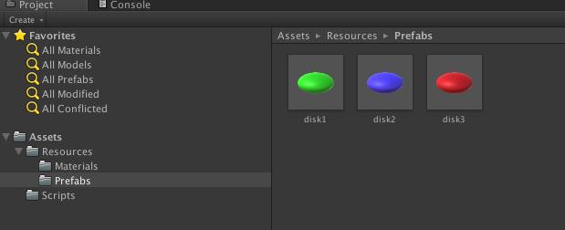
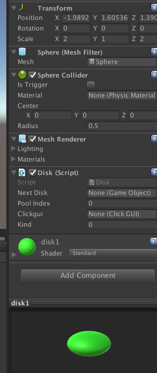
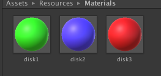
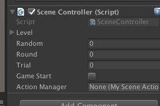
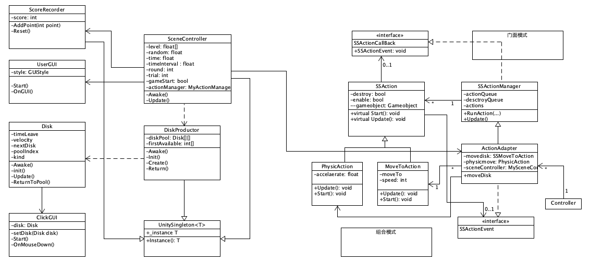
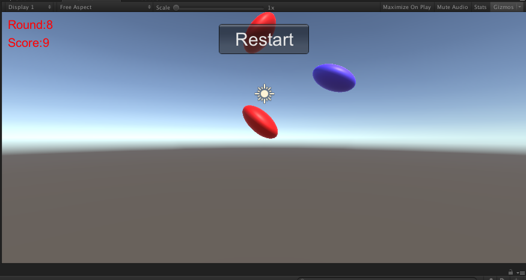

## 3dgame 作业6

#### 1. 作业内容

改进飞碟（Hit UFO）游戏：

游戏内容要求：

1. 按 *adapter模式* 设计图修改飞碟游戏
2. 使它同时支持物理运动与运动学（变换）运动

#### 2. 游戏配置

1. 游戏中共有三种飞碟，创建好三个飞碟的预制类。



2. 在三个预制类中分别添加Disk脚本，并且设置好每个预制类的大小。



3. 创建好三种飞碟不同的材质，并添加。



4. 创建一个空对象，并将SceneController添加到该对象中，即可运行。



#### 3. UML类图



* 与上一次作业相比，多了一个PhysicAction用于给物体添加重力影响，还有就是添加了一个ActionAdapter，与PhysicAction 和MoveToAction关联，从而从而使得SceneController更加容易的调用物体运动的方法。

#### 4. 分析

##### 1. 适配器模式(Adapter Pattern)：

将一个接口转换成客户希望的另一个接口，使接口不兼容的那些类可以一起工作。适配器模式既可以作为类结构型模式，也可以作为对象结构型模式。在适配器模式中，我们通过增加一个新的适配器类来解决接口不兼容的问题，使得原本没有任何关系的类可以协同工作。

根据适配器类与适配者类的关系不同，适配器模式可分为对象适配器和类适配器两种，在对象适配器模式中，适配器与适配者之间是关联关系；在类适配器模式中，适配器与适配者之间是继承（或实现）关系。

这里使用了ActionAdapter与PhysicAction 和MoveToAction关联，从而更加方便的调用SSAction接口的方法。

##### 2. 物理运动与运动学（变换）运动

物理运动包括物体的碰撞以及物体的重力影响，重力影响可以通过给物体添加一个逐渐均匀变大的速度实现。而物体的碰撞以及运动学变换可以通过给对象添加unity内置的DigidBody实现，添加之后，对象就会拥有与真实情况相同的物理特性，包括与物理碰撞之后的反应，以及可以对物体施加力的作用进行加速。

#### 5. 代码

* UnitySingleton类
* 给每个需要单实例化的类继承，包括SceneController、DiskProductor、ScoreRecorder让其可以单实例话，同时可以静态被其他类调用。

~~~c#
public class UnitySingleton<T> : MonoBehaviour where T : Component {
	//用于单例实例化
	protected static T _instance;

	public static T Instance() {
		if (_instance == null) { 
			_instance = FindObjectOfType(typeof(T)) as T;
			if (_instance == null) {
				GameObject obj = new GameObject();
				obj.name = typeof(T).ToString();
				_instance = obj.AddComponent<T>();
			}
		}
		return _instance;
	}
}
~~~

* SceneCotnroller

* 场景总控制类，调用各个接口以及创建、添加所需要的对象。

~~~c#
using System.Collections;
using System.Collections.Generic;
using UnityEngine;

[System.Serializable]


public class SceneController : UnitySingleton<SceneController>{

	public static int roundNum = 10;				//回合数量
	public static int trialNumber = 10;				//每个Round有多少个trial

	public float[] level = new float[roundNum]; 		//记录每个round出现的时间间隔，每个round的记录难度
	public float random; 							//时间间隔随机部分的范围

	private float time;								//用于计时
	private float timeInterval;						//记录时间间隔

	[SerializeField] private int round;				//round记录第几个回合
	[SerializeField] private int trial;				//count记录第几个trial

	public bool gameStart;
	public ActionAdapter action;		//动作管理对象

	void Awake() {
		_instance = this;
		for (int i = 0; i < roundNum; i++) {		//初始化每个round的难度，round值越大，时间间隔越小，难度越高
			level [i] = 2f - 0.1f * roundNum;
		}
		time = 0; timeInterval = 0; round = 0; trial = 0;
		gameStart = false;							//游戏初始状态为等待
		random = 0.1f;								//飞碟时间随机浮动范围

		action = gameObject.AddComponent<ActionAdapter> () as ActionAdapter;
		gameObject.AddComponent<UserGUI> ();		//添加用户界面
		DiskProductor.Instance(); 					//初始化disk对象创建工厂
		ScoreRecorder.Instance();					//初始化计分器
	}

	void Update() {
		if (gameStart) {							//判断游戏是否已经开始
			time += Time.deltaTime;
			if (time < timeInterval)				//时间没到返回
				return;	
			else {									//时间到创建disk，并且计算得到下一次创建的时间间隔
				trial ++;
				CreateDisk (Random.Range(1, round + 1 / 2));
				time -= timeInterval;
				timeInterval = level [round] + Random.Range (-random, random);
				if (trial < trialNumber)
					return;  
				trial = 0;							//一个回合结束
				if (round < 9)
					round++;
			}
		}
	}

	void CreateDisk(int num) {
		//生成随机位置，调用disk工厂创建disk
		float py = Random.Range (0, 4);
		for (int i = 0; i < num; i++) { 			//随机创建多个飞碟
			Vector3 pos = new Vector3 (10f, py + i * 2, 0);	//为了开始不碰撞，均匀分配disk的位置
			Vector3 v = new Vector3 (-10f, Random.Range (-0.2f, 0.2f), 0);
			int kind = Random.Range (0, 3);			//随机选择三种飞碟的一种
			//创建disk，并且通过adapter给disk创建运动对象
			Disk tem = DiskProductor.Instance ().Create (pos, v, 5f, kind);
			action.moveDisk (tem.gameObject, tem.velocity * (tem.kind + 1), 50);
		}
	}
	public void Reset() {							//重置函数
		time = 0; timeInterval = 0; round = 0; trial = 0;
		DiskProductor.Instance ().Reset ();
		ScoreRecorder.Instance ().Reset ();
	}
	public int GetRoundIndex() {					//获得回合数
		return round;
	}
}
~~~

* Disk

* 每个飞碟对象的脚本类，存储每个了飞碟的信息，以及返回对象池、运动的方法。

~~~c#
using System.Collections;
using System.Collections.Generic;
using UnityEngine;

public class Disk : MonoBehaviour {

	private float timeLeave;			//记录每个disk剩余飞行的时间
	public  Vector3 velocity;			//每个飞碟的基础速度,disk的速度由基础速度与种类决定
	public GameObject nextDisk;			//记录下一个空闲的飞碟
	public int poolIndex;				//记录该飞碟对象在对象池中的位置
	public ClickGUI clickgui;			//每个飞碟的鼠标点击响应脚本
	public int kind;					//记录每个飞碟对象的类型
	public Rigidbody rigid;
	bool enableEmit = true;

	void Awake() {
		timeLeave = 0;
		/*
		 *创建、设置飞碟脚本 
		*/
		clickgui = this.gameObject.AddComponent(typeof(ClickGUI)) as ClickGUI;
		rigid = this.gameObject.AddComponent<Rigidbody> ();
		clickgui.setDisk(this);
	}

	public void init(Vector3 _position, Vector3 _velocity, float _lifeTime) {
		this.transform.position = _position;
		timeLeave = _lifeTime;
		velocity = _velocity;
	}

	void Update() {
		timeLeave -= Time.deltaTime;
		if (timeLeave < 0 || gameObject.transform.position.y < -5 || gameObject.transform.position.x < -10) 				//时间到了，返回到对象池
			ReturnToPool();
	}

	public void ReturnToPool() {
		gameObject.GetComponent<Rigidbody>().velocity = Vector3.zero;
		DiskProductor.Instance().Return(poolIndex, kind);
	}
}
~~~

* ScoreRecorder
* 记录分数

~~~c#
public class ScoreRecorder : UnitySingleton<ScoreRecorder>
{
	public int score;                   //分数
	void Start () {
		score = 0;
	}
	//记录分数
	public void AddPoint(int point) {
		score += point;
	}

	public void Reset() {
		score = 0;
	}
}
~~~

* ClickGUI
* 与上次作业类似，给每一个飞碟对象使用。不同的是点击后分数增加、调用对象的返回对象池函数。

~~~c#
public class ClickGUI : MonoBehaviour {

	// Use this for initialization
	Disk disk;

	public void setDisk(Disk disk){
		this.disk = disk;
	}
	void OnMouseDown(){
		ScoreRecorder.Instance ().AddPoint (disk.kind + 1);
		disk.ReturnToPool ();
	}
}
~~~

* UserGUI
* 用户界面，包括游戏重启、游戏开始，分数、回合显示。

~~~c#
public class UserGUI : MonoBehaviour{
	private GUIStyle MyStyle;
	private GUIStyle MyButtonStyle;

	void Start() {
		MyStyle = new GUIStyle ();
		MyStyle.fontSize = 20;
		MyStyle.normal.textColor = new Color (255f, 0, 0);

		MyButtonStyle = new GUIStyle ("button");
		MyButtonStyle.fontSize = 30;
	}
	void OnGUI() {
		//回合显示
		GUI.Label (new Rect (10, 10, 100, 20), "Round:" + (SceneController.Instance ().GetRoundIndex () + 1), MyStyle);
		//分数显示
		GUI.Label (new Rect (10, 40, 100, 20), "Score:" + (ScoreRecorder.Instance().score), MyStyle);
		if (SceneController.Instance ().gameStart) {
			//重启
			if (GUI.Button (new Rect (Screen.width / 2 - 75, 20, 150, 50), "Restart", MyButtonStyle)) {
				SceneController.Instance ().Reset ();
				SceneController.Instance ().gameStart = false;
			}
		} else {
			//游戏开始
			if (GUI.Button (new Rect (Screen.width / 2 - 75, 20, 150, 50), "Start", MyButtonStyle)) {
				SceneController.Instance ().gameStart = true;
			}
		}
	}
}
~~~

* MoveToAction类

* 物体运动的实现。将之前的每一帧移动改为添加一个力，同时修改为使用FixedUpdate实现运动，为了物体做匀速运动，只需要给物体添加一次力，所以该类的addforce只调用一次，同时在调用完后会被释放。

```c#
using System.Collections;
using System.Collections.Generic;
using UnityEngine;

public class SSMoveToAction : SSAction                        //移动
{
	public Vector3 dest;        //移动到的目的地
	public float speed;           //移动速度
	public bool enableEmit = true;
	public Vector3 force;

	private SSMoveToAction() { }
	public static SSMoveToAction GetSSAction(Vector3 force, float speed) {
		SSMoveToAction action = ScriptableObject.CreateInstance<SSMoveToAction>();//创建实例
		action.force = force;
		action.speed = speed;
		return action;
	}

	public override void Update() {

	}
	public override void FixedUpdate() {	//给物体添加力的时候需要使用FixedUpdate函数
		if(!this.destroy) {		
			if(enableEmit) {				//给物体添加一个力，从而给物体一个初速度
				gameobject.GetComponent<Rigidbody>().AddForce(force, ForceMode.Impulse);
				enableEmit = false;
			}
			this.destroy = true;			//添加完力就进入回收队列
			this.callback.SSActionEvent(this); 
		}
	}

	public override void Start() {
		//移动过程无动作
	}
}
```

* PhysicAction

* 通过Rigidbody中的velocity属性实现物理的重力影响，每次调用都会增加物体向下的速度。

```c#
using System.Collections;
using System.Collections.Generic;
using UnityEngine;

public class PhysicAction : SSAction {	
	float acceleration;						//重力加速度

	private PhysicAction() { }
	public static PhysicAction GetPhysicAction() {
		PhysicAction action = ScriptableObject.CreateInstance<PhysicAction>();//创建实例
		return action;
	}
	public override void Start () {
		acceleration = 9.8f;
	}

	public override void Update () {
		if (gameobject.activeSelf) {		//物体运动期间，每隔一个时间单位，物体的速度会加上一个a
			gameobject.GetComponent<Rigidbody> ().velocity += Vector3.down * acceleration * Time.deltaTime;
		} else {							//disk返回后回收该动作对象
			this.destroy = true;
			this.callback.SSActionEvent(this); 
		}

	}

	public override void FixedUpdate() {
	}
}
```

* ActionAdapter类

* 将物体两个运动创建的接口MoveToAction、PhysicAction，转化为主控制器直接使用的接口。

```c#
using System.Collections;
using System.Collections.Generic;
using UnityEngine;

public class ActionAdapter : SSActionManager{
	private SSMoveToAction movedisk;
	private PhysicAction physic;
	public SceneController sceneController;
	public void Start(){
		sceneController = SceneController.Instance();
		sceneController.action = this;
	}

	public void moveDisk(GameObject disk, Vector3 dest, float speed) {
		movedisk = SSMoveToAction.GetSSAction (dest, speed);		//获得被是配的对象
		this.RunAction (disk, movedisk, this);						//调用被是配对象的函数
		physic = PhysicAction.GetPhysicAction ();
		this.RunAction (disk, physic, this);
	}
}


```


游戏图片以及视频、代码地址。



视频地址：https://www.bilibili.com/video/av70686629/

或者：hw5.mov

代码地址：https://github.com/ouzj5/3dgame/tree/master/hw5

