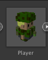
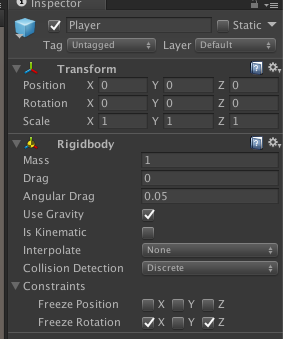
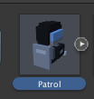
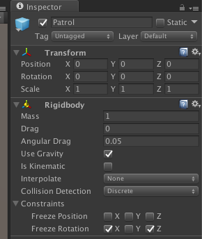
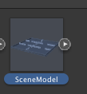
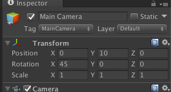
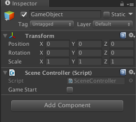
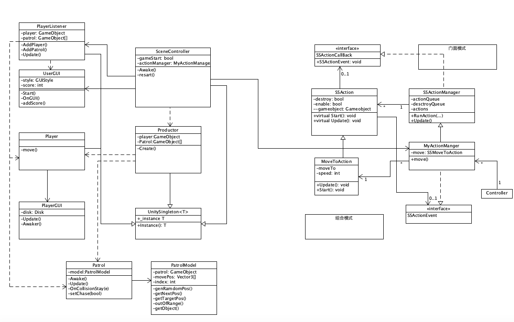
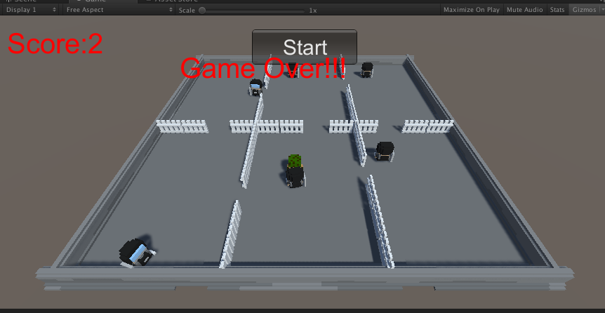

## 3dgame 作业7

### 1. 作业内容

智能巡逻兵

- 提交要求：
- 游戏设计要求：
  - 创建一个地图和若干巡逻兵(使用动画)；
  - 每个巡逻兵走一个3~5个边的凸多边型，位置数据是相对地址。即每次确定下一个目标位置，用自己当前位置为原点计算；
  - 巡逻兵碰撞到障碍物，则会自动选下一个点为目标；
  - 巡逻兵在设定范围内感知到玩家，会自动追击玩家；
  - 失去玩家目标后，继续巡逻；
  - 计分：玩家每次甩掉一个巡逻兵计一分，与巡逻兵碰撞游戏结束；
- 程序设计要求：
  - 必须使用订阅与发布模式传消息
    - subject：OnLostGoal
    - Publisher: ?
    - Subscriber: ?
  - 工厂模式生产巡逻兵

### 2. 游戏配置

1. 玩家操控人物预制。

* 图像



* 属性



属性这里需要将其在平面上的旋转限制掉，不然发生碰撞后，人物会倒。

2. 巡逻兵预制。

* 图像



* 属性



3. 场景预制

* 图像



4. 相机

* 属性



相机为了让玩家有个立体感，所以这里需要调整一下相机的角度。

5. 脚本

* 空对象



创建一个空对象，添加SceneController用于游戏的初始化。

### 3. UML类图



### 4. 分析

* 订阅与发布模式传消息

  这里动作的管理以及大体的控制、模型模式与之前大体类似，不同的是，玩家人物与巡逻兵间需要使用订阅与发布模式传消息，这里的publisher就是PlayListener类，subscriber就是人物以及巡逻兵，触发的时间就是player所在块的索引变化，也就是从一个块移动到另外一个块。

* 巡逻兵确定位置

  这里因为每一次只确认一个位置，所以这里需要通过动作回调函数来实现每次确认一个位置。

* 巡逻兵在设定范围内感知到玩家，会自动追击玩家，失去玩家目标后，继续巡逻

  这里通过判断玩家所在的区块索引来实现。

* 巡逻兵碰撞到障碍物，则会自动选下一个点为目标

  这里需要碰撞后重新添加动作，并把原来的撞墙动作删除掉，不然就一直会撞。

### 5. 关键代码

* SceneCotnroller
* 场景总控制类，调用各个接口以及创建、添加所需要的对象。

~~~
public class SceneController : UnitySingleton<SceneController>{
	MyActionManager actionManager;
	public bool gameStart = false;
	public SceneController() {
	
	}
	void Awake() {
		//init model, action manager, userGui
		SceneModel.Instance ();					
		actionManager = gameObject.AddComponent<MyActionManager>() as MyActionManager;
		UserGUI.Instance ();
		//load the scene prefabs
		Instantiate(Resources.Load<GameObject> ("Prefabs/SceneModel"));
		//init factory, and use it to load prefabs
		PatrolFactory.Instance ().load ();
	}
	public MyActionManager getActionManager() {
		return actionManager;
	}
	public void restart() {
		//restart game
		PatrolFactory.Instance ().restart();
		gameStart = true;
	}
}

~~~

* PatrolFactory
* 用于创建、初始化玩家操控的人物，以及巡逻兵，同时将玩家与巡逻兵添加到监听类PlayerListener中。

~~~
class PatrolFactory : UnitySingleton<PatrolFactory>{
	//patrol init position
	private Vector3[] pos = new Vector3[] { new Vector3(-6, 0, 16), new Vector3(-1, 0, 19),
		new Vector3(6, 0, 16), new Vector3(-5, 0, 7), new Vector3(0, 0, 7), new Vector3(6, 0, 7)};
	GameObject[] patrolList = new GameObject[6];
	GameObject player;
	public PatrolFactory() {
		
	}
	public void load() {
		//load and init the player
		player = Instantiate(Resources.Load<GameObject> ("Prefabs/Player"));
		player.transform.position =new Vector3(-8, 0, 20);
		player.name = "Player";
		player.AddComponent<Player> ();								//add the script
		player.AddComponent<PlayerGUI> ();							//add click response
		PlayerListener.Instance ().addPlayer(player);				//add listener

		for (int i = 0; i < 6; i++) {
			patrolList [i] = Instantiate (Resources.Load<GameObject> ("Prefabs/Patrol"));
			patrolList [i].transform.position = pos [i];
			patrolList [i].name = "Patrol" + i;
			patrolList [i].AddComponent<Patrol> ();					//add the script
			PlayerListener.Instance ().addPatrol(patrolList[i]);	//add listener

		}	
	}
	public void restart() {
		//restart by init object position
		player.transform.position =new Vector3(-8, 0, 20);
		for (int i = 0; i < 6; i++) {
			patrolList [i].transform.position = pos [i];
		}
	}
}


~~~

* Patrol
* 巡逻兵脚本，操控巡逻兵的运动，设置一个done标志保持一个动作完成后才能做下一个动作。send函数用与让动作发消息到对应的巡逻兵中，chase用于判断所在块是否有玩家。

```
using System;
using System.Collections.Generic;
using UnityEngine;

public class Patrol : MonoBehaviour{
	PatrolModel model;						//model
	float speed;							//speed of the patrol
	public bool chase = false;				//the flag of chasing player
	bool done;								//use as flag of action complete 
	public void Awake(){
		done = true;
		speed = 0.05f;
		model = new PatrolModel (this.gameObject);
	}
	public void addMove() {
		if (!chase) {						//random to move
			Vector3 target = model.getNextPos ();
			SceneController.Instance ().getActionManager ().moveBoat (model.getObject (), target, speed);
		} else {							//chase the player
			Vector3 target = model.getTargetPos ();
			SceneController.Instance().getActionManager().moveBoat (model.getObject (), target, speed);
		}
	}
	public void Update() {
		if (done) {
			addMove ();
			done = false;
		}
	}
	public void send() {
		//use for create a new movemenet
		done = true;
	}
	void OnCollisionStay(Collision e) {
		if (e.gameObject.name.Contains ("Patrol") || e.gameObject.name.Contains ("fence")
		    || e.gameObject.tag.Contains ("FenceAround")) {
			//chose next to move
			send ();
		} else if (e.gameObject.name.Contains ("Player")) {
			//gg
			UserGUI.Instance ().gameOver ();
		}
	}
	public void setChase(bool chase) {
		//set the chase mode
		this.chase = chase;
	}
}
```

* PatrolModel
* patrol的数据保存判断、以及生成。数据生成需要生成下一个移动的方向，如果不是追逐状态，这里需要与上一次的移动方向不一样，不然可能连续撞墙；如果是追逐状态就通过玩家的位置以及当前位置来计算出下一次移动的位置。

~~~
using System.Collections;
using System.Collections.Generic;
using UnityEngine;

public class PatrolModel {
	GameObject patrol;
	Direction curDir;
	public Vector3 [] move = {new Vector3(-1f, 0, 0), new Vector3(0, 0, 1f), new Vector3(1f, 0, 0), new Vector3(0, 0, -1f)};
	public int index;

	public PatrolModel (GameObject patrol) {
		curDir = (Direction)Random.Range (0, 4);
		this.patrol = patrol;
		index = SceneModel.Instance ().getAreaIndex (patrol.transform.position);
	}
	public Direction genRandomDir() {
		//generagte a random diretcion
		Direction randomDir = (Direction)Random.Range(0, 4);
		while (curDir == randomDir || outOfRange(randomDir)) {
			//cant't be the same dir
			randomDir = (Direction)Random.Range(0, 4);
		}
		return randomDir;
	}
	public bool outOfRange(Direction dir) {
		//judege whther out of range
		return SceneModel.Instance ().getAreaIndex (patrol.transform.position + move [(int)dir]) != index;
	}	
	public Vector3 getNextPos() {
		//get next random pos
		curDir = genRandomDir ();
		return patrol.transform.position + move [(int)curDir];
	}
	public Vector3 getTargetPos() {
		//set the targte to player
		GameObject player = Player.Instance ().gameObject;
		patrol.transform.LookAt(player.transform);
		Vector3 diff = player.transform.position - patrol.transform.position;
		return patrol.transform.position + diff / 4.0f;
	}
	public GameObject getObject() {
		return patrol;
	}
}


~~~

* Player
* 控制玩家人物的运动

~~~
public class Player : UnitySingleton<Player> {
	
	public void move(Direction direction) {
		if (!SceneController.Instance ().gameStart)
			return;
		gameObject.transform.rotation = Quaternion.Euler(new Vector3(0, ((int)direction - 1) * 90, 0));
		switch (direction) {
		case Direction.UP:
			gameObject.transform.position += new Vector3(0, 0, 0.1f);
			break;
		case Direction.DOWN:
			gameObject.transform.position += new Vector3(0, 0, -0.1f);
			break;
		case Direction.LEFT:
			gameObject.transform.position += new Vector3(-0.1f, 0, 0);
			break;
		case Direction.RIGHT:
			gameObject.transform.position += new Vector3(0.1f, 0, 0);
			break;
		}
	}
}
~~~

* PlayerListener
* 监听玩家区块变化事件，如果发生则改变对应的巡逻兵状态。

~~~
public class PlayerListener : UnitySingleton<PlayerListener>{
	GameObject player;
	int pindex = 0;
	List<GameObject> patrol = new List<GameObject>();
	public PlayerListener () {
		
	}
	public void addPlayer(GameObject player) {
		this.player = player;
	}
	public void addPatrol(GameObject patrol) {
		this.patrol.Add (patrol);
	}
	public void Update() {
		//listen player area index
		int curIndex = SceneModel.Instance ().getAreaIndex (player.transform.position);
		patrol [curIndex].GetComponent<Patrol> ().setChase (true);
		if (pindex != curIndex) {
			//if change, change the relevent patrol
			UserGUI.Instance ().addScore ();
			patrol [pindex].GetComponent<Patrol> ().setChase (false);
			pindex = curIndex;
		}
	}
}


~~~

* ActionManager
* 这里的动作管理有一点区别，动作完成后回调函数需要发送动作完成的消息给对应的对象。

~~~
public class SSActionManager : MonoBehaviour, ISSActionCallback   //action管理器 
{
	...
	public void SSActionEvent(SSAction source, SSActionEventType events = 		SSActionEventType.Competeted,
		int intParam = 0, string strParam = null, Object objectParam = null) {
		//游戏对象移动完成后没有的动作
		source.gameobject.GetComponent<Patrol> ().send();
	}
	...
}
~~~

* SceneModel
* 保存场景数据以及计算区块索引。

~~~
public class SceneModel : UnitySingleton<SceneModel>{
	float verFence = 12.6f;
	float leftFence = -3f;
	public int getAreaIndex(Vector3 pos) {
		//get the area index by postion
		if (pos.z >= verFence) {
			if (pos.x < leftFence)
				return 0;
			else if (pos.x > rightFence)
				return 2;
			else
				return 1;
		}
		else {
			if (pos.x < leftFence)
				return 3;
			else if (pos.x > rightFence)
				return 5;
			else
				return 4;
		}
	}
}
~~~

### 6. 游戏图片以及视频、代码地址。



视频网站：https://www.bilibili.com/video/av73422218/

或hw7.mov

代码地址：https://github.com/ouzj5/3dgame/tree/master/hw7