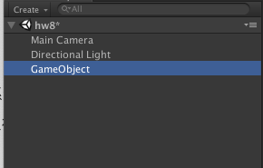
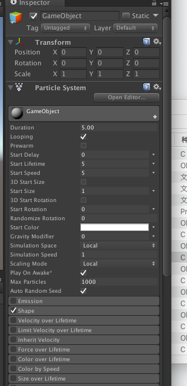
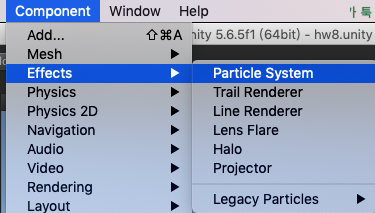
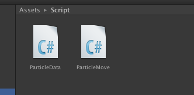
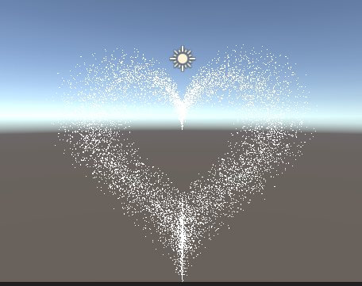

## 3dgame作业8

### 1. 作业内容

简单粒子制作

- 按参考资源要求，制作一个粒子系统，[参考资源](http://www.cnblogs.com/CaomaoUnity3d/p/5983730.html)
- 使用 3.3 节介绍，用代码控制使之在不同场景下效果不一样

### 2. 配置

1. 首先在场景中新建一个空对象。

2. 然后，再为这个对象给它加一个组件“粒子系统”。 

3. 粒子组建通过Component->Effects->Particle System添加

4. 因为这里要求是代码实现所以并不需要直接对粒子系统的进行设置。所以创建好后就可以开始写脚本了。

### 3.代码部分

步骤一：

建立一个ParticleData类存放每个粒子的基本信息，包括位置、时间以及角度，这样才更好的去设置好每一个粒子的运动。

~~~
public class ParticleData{
	public float radius = 0f, angle = 0f, time = 0f;
	public ParticleData(float radius, float angle, float time) {
		this.radius = radius;
		this.angle = angle;
		this.time = time;
	}
}

~~~

步骤二：

定义好用于存放粒子系统以及粒子对象、信息的数组，除此之外还有一个颜色渐变器。前者用于粒子属性以及位置的设置，后者用于粒子颜色的变化。

~~~
private ParticleSystem particlesys;  			// 粒子系统
	private ParticleSystem.Particle[] particleArr;  // 粒子数组  
	private ParticleData[] particles; 				// 粒子数据数组
	public Gradient colorGradient; 					// 粒子颜色渐变
~~~

步骤三：

设置好粒子运动所需的参数，并且在运行过程中进行适当的调整。

~~~
public int count = 10000;       				// 粒子数量  
	public float size = 0.03f;      				// 粒子大小  
	public float minRad = 1f;  						// 最小半径  
	public float maxRad = 3f; 						// 最大半径  
	public bool clock = true;   					// 顺时针|逆时针  
	public float speed = 2f;        				// 速度
	public float pingPong = 0.002f;  				// 游离范围
~~~

步骤四：

初始化每个粒子的位置、角度等信息，同时使用随机函数使得粒子具有随机性。同时这里参考了前人的作品，可以通过比例来使得粒子更加集中于中心，但是又会随机的分散开，这样子图像就会更加可观，但又不失随机性。

~~~
// 随机每个粒子距离中心的半径，通过比例调节粒子更加集中于中心，但会随机的分散开
			float midRadius = (maxRad + minRad) / 2;
			float minRate = Random.Range(1.0f, midRadius / minRad);
			float maxRate = Random.Range(midRadius / maxRad, 1.0f);
			float radius = Random.Range(minRad * minRate, maxRad * maxRate);

			// 随机每个粒子的角度  
			float angle = Random.Range(0.0f,360.0f);
			float theta = angle / 180 * Mathf.PI;

			// 随机每个粒子的游离起始时间  
			float time = Random.Range(0.0f, 360.0f);
			//给每个粒子赋值，并保存粒子数据
			particles[i] = new ParticleData(radius, angle, time);
			
~~~

步骤五：

update函数。通过设置好粒子在每一帧的位置来实现粒子的移动，这里需要根据不同运动的图形来设置。首先判断是顺时针还是逆时针，顺时针就是减一个值，逆时针就是加一个值，这里用的是弧度的公式，通过弧度以及半径就可以求出弧长，从而得到每次运动的距离（速度）。

~~~
if (clock)  // 顺时针旋转  
				particles[i].angle -= (i % tier + 1) * (speed / particles[i].radius / tier);
else            // 逆时针旋转  
        particles[i].angle += (i % tier + 1) * (speed / particles[i].radius / tier);
~~~

同时，在加减角度的同时有可能会使得粒子角度超出360，所以就通过一下命令保证粒子的角度在0~360之间。

~~~
particles[i].angle = (360 + particles[i].angle) % 360.0f;
~~~

步骤六：

在设置好角度后，就要具体设置好粒子的位置了，这里就要用到上面粒子保存的角度信息，如果是圆周运动就是，根据数学，这个时候粒子距离远点的距离相等，所以粒子进行圆周运动。

~~~
particleArr[i].position = new Vector3(particles[i].radius * Mathf.Cos(theta), 0f, particles[i].radius * Mathf.Sin(theta));
~~~

除了圆周运动外，还可以有其他更加有意思的粒子运动，如使用下面命令会使粒子进行心形运动，原理就是该函数的图像是心形。具体就是坐标为$(16sin^2x, 13cosx - 5cos2x - 2cos3x- cos4x)$，函数有点复杂，但只需要改一行就能够实现了，十分简单。

~~~
particleArr[i].position = new Vector3(0.1f * particles[i].radius * 16 * Mathf.Sin(theta) * Mathf.Sin(theta) * Mathf.Sin(theta), 0.1f * particles[i].radius *(13 * Mathf.Cos(theta) - 5 * Mathf.Cos(theta * 2) - 2 * Mathf.Cos(theta * 3) - Mathf.Cos(4 * theta)), 0f);

~~~

步骤七：

除此以外还需要一些半径内粒子的随机跳动，这里用的是自带的PingPong函数，这样粒子就更加具有随机性，更加的好看了。

~~~
particles[i].radius += Mathf.PingPong(particles[i].time / minRad / maxRad, pingPong) - pingPong / 2.0f;
~~~

### 4.游戏图片以及视频、代码地址。

视频网站：https://www.bilibili.com/video/av75156279/

或hw8.mov

代码地址：https://github.com/ouzj5/3dgame/tree/master/hw8