## 血条(Health Bar)的预制设计

### 1.作业内容

血条（Health Bar）的预制设计。具体要求如下

- 分别使用 IMGUI 和 UGUI 实现
- 使用 UGUI，血条是游戏对象的一个子元素，任何时候需要面对主摄像机
- 分析两种实现的优缺点
- 给出预制的使用方法

### 2. IMGUI实现

IMGUI系统是Unity基于GameObject的主UI的一个完全独立的特性系统。IMGUI是一个代码驱动的GUI系统，主要用作程序员的工具，它是由对实现它的任何脚本上的OnGUI函数的调用驱动的，没有图形化设计界面。

1. 血条的实现主要使用的是GUI中的水平滚动条，用滚动条的宽度来作为血条的显示，这里的参数分别时设置萧条的位置以及宽度、高度为`(50, 50, 200, 20)`，然后设置

~~~
GUI.HorizontalScrollbar(new Rect(50, 50, 200, 20), 0.0f, health, 0.0f, 1.0f);
~~~

2. 然后创建两个按钮用于加血以及扣血，设置一个变量用于记录调整后的血量。

* 加血按钮

~~~
if (GUI.Button(new Rect(105, 80, 40, 20), "加血"))
		{
			resulthealth = resulthealth + 0.1f > 1.0f ? 1.0f : resulthealth + 0.1f;
		}
~~~

* 扣血按钮

~~~
if (GUI.Button(new Rect(155, 80, 40, 20), "扣血"))
		{
			resulthealth = resulthealth - 0.1f < 0.0f ? 0.0f : resulthealth - 0.1f;
		}
~~~

3. 根据调整后的血量调整水平滚动条。首先使用内置的插值函数算出下一个调整的值，然后将得到的值赋值给当前血量，从而实现血条的平滑变化。

~~~
health = Mathf.Lerp(health, resulthealth, 0.05f);
~~~

4. 创建血条预制。首先创建一个空对象，然后将该脚本添加到空对象中，然后将该对象拖动到Assets中就可以做成预制。

   * 添加脚本

   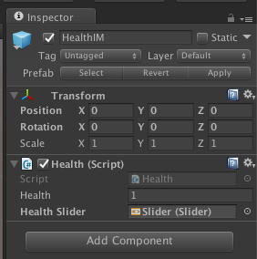

   * 预制

   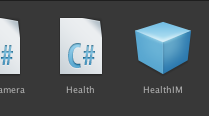

5. 结果显示

   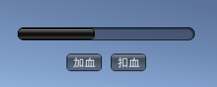

#### 全部代码

```
public class Health : MonoBehaviour
{
	// 当前血量
	public float health = 1f;
	// 增/减后血量
	private float resulthealth;
	public Slider healthSlider;


	void Start() {
		resulthealth = health;
	}

	void OnGUI() {
		if (GUI.Button(new Rect(105, 80, 40, 20), "加血"))
		{
			resulthealth = resulthealth + 0.1f > 1.0f ? 1.0f : resulthealth + 0.1f;
		}
		if (GUI.Button(new Rect(155, 80, 40, 20), "扣血"))
		{
			resulthealth = resulthealth - 0.1f < 0.0f ? 0.0f : resulthealth - 0.1f;
		}

		//插值计算health值，以实现血条值平滑变化
		health = Mathf.Lerp(health, resulthealth, 0.05f);
		healthSlider.value = health;

		// 用水平滚动条的宽度作为血条的显示值
		GUI.HorizontalScrollbar(new Rect(50, 50, 200, 20), 0.0f, health, 0.0f, 1.0f);
	}
}
```

#### 效果显示

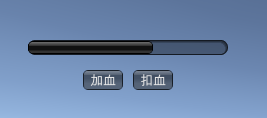

### 3. UGUI实现

使用 UGUI，血条是游戏对象的一个子元素，任何时候需要面对主摄像机

1. 首先创建一个人物对象，这里用到上一次用到的人物，并且给人物添加一个用于移动的脚本，方便到时候测试在移动时血条是否还在面对主摄像机。

   * 人物预制

     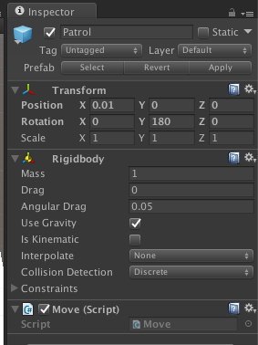

   * 移动脚本

     ```
     public class Move : MonoBehaviour{
     	public void Awake() {
     		
     	}
     	public void Update() {
     		if (Input.GetKey(KeyCode.UpArrow)) {
     			move(Direction.UP);
     		}
     		if (Input.GetKey(KeyCode.DownArrow)) {
     			move(Direction.DOWN);
     		}
     		if (Input.GetKey(KeyCode.LeftArrow)) {
     			move(Direction.LEFT);
     		}
     		if (Input.GetKey(KeyCode.RightArrow)) {
     			move(Direction.RIGHT);
     		}
     	}
     	public enum Direction : int {LEFT = 0, UP, RIGHT, DOWN};
     
     		public void move(Direction direction) {
     			gameObject.transform.rotation = Quaternion.Euler(new Vector3(0, ((int)direction - 1) * 90, 0));
     			switch (direction) {
     			case Direction.UP:
     				gameObject.transform.position += new Vector3(0, 0, 0.1f);
     				break;
     			case Direction.DOWN:
     				gameObject.transform.position += new Vector3(0, 0, -0.1f);
     				break;
     			case Direction.LEFT:
     				gameObject.transform.position += new Vector3(-0.1f, 0, 0);
     				break;
     			case Direction.RIGHT:
     				gameObject.transform.position += new Vector3(0.1f, 0, 0);
     				break;
     			}
     		}
     }
     
     ```

   2. 设置好摄像机的位置

      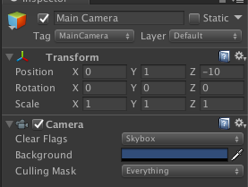

   3. 设置好位置信息开始添加血条。首先右键点击需要添加血条的对象，然后选择UI -> Canvas，添加画布子对象，添加画布后人物会多一个Canvas子对象，这里改名为HeathUI。

      添加画布

   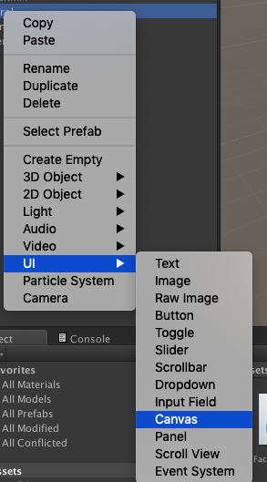

   * heathUI

   ​		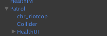

4. 右键点击刚刚的画布（HeathUI）选择添加 UI -> Slider，然后画布会多了一个子对象slider，同时slider也有三个子对象，分别是背景(background)，填充区域(fill area)以及操作按钮(Handle Slider Area)，这里不需要用到拉动按钮所以将其disable。

   * slider

     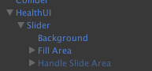

5. 然后设置好background颜色，因为是血条所以将其设置为红色，就是被扣血部分为红色。

   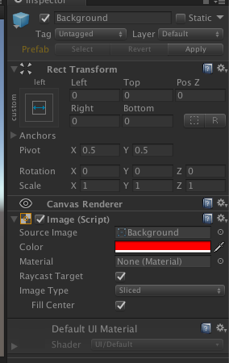

6. 然后设置好填充区域子对象fill的颜色为灰色，表示未扣的血。

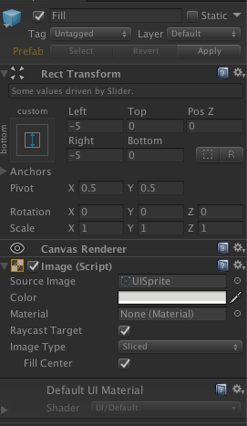

7. 为了方便就复用上一步创建好的按钮，在脚本中添加slider对象，然后将Slider添加到加血、扣血的按钮脚本，同时在OnGUI中设置好每一帧slider的值。

* 添加脚本

~~~
public Slider healthSlider;
void OnGUI() {
	...
	healthSlider.value = health;
	...
}
~~~

* 设置好slider对象

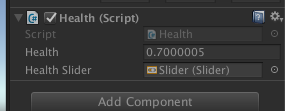

8. 最后给HealthUI添加一个FaceCamera对象，使得无论人物如何移动，血条始终对准镜头。

* FaceCamera

```
public class FaceCamera : MonoBehaviour {
	
	// Update is called once per frame
	void Update () {
		this.transform.LookAt (Camera.main.transform.position);
	}
}
```

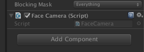

9. 结果显示

   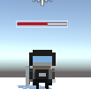

### 4. 分析两种实现的优缺点

#### IMGUI:

优点：

	1. 在不做复杂的界面前提下，代码简单易用的代码是程序员喜欢的，存在符合游戏编程的传统习惯。
 	2. 在修改模型，渲染模型这样的经典游戏循环编程模式中，在渲染阶段之后，绘制 UI 界面无可挑剔。

3. 既避免了 UI 元素只能在在屏幕前端设置，又有很好的执行效率，一切控制都能通过代码实现，这对早期计算和存储资源贫乏的游戏设备来说，更是十分友好。

缺点：

1. 传统代码驱动的 UI 效率低下。
2. 调试困难，每一次调试都需要编译。

3. 复杂界面代码编写较为困难，没有直接的界面显示。

#### UGUI：

优点：

1. 所见即所得（WYSIWYG）设计工具，如地图编辑器、菜单编辑器等工具，使用这些工具就可直接创造游戏元素，只需要简单的UI添加以及设置，使得设计师也能参与游戏开发。
2. 支持多模式、多摄像机渲染。
3. UI 元素与游戏场景融为一体的交互。
4. 面向对象的编程，可以更好的管理对象。

### 5. 给出预制的使用方法

1. 首先是预制的创建，IMGUI是将放置了脚本的空对象直接拖到Asset中，UGUI是将画布（HeathUI）拖到Assets中。

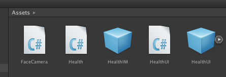

2. 然后是预制的使用方法。IMGUI、UGUI都是是直接将拖动到人物对象中，不过UGUI还需要将自对象的Slider委托给一个脚本进行管理，如上面讲slider委托给IMGUI中创建的按钮进行管理。

   * 加减血按钮

   

   * UGUI


### 5.游戏图片以及视频、代码地址。


视频网站：https://www.bilibili.com/video/av76512160/

或hw9.mov

代码地址：https://github.com/ouzj5/3dgame/tree/master/hw9